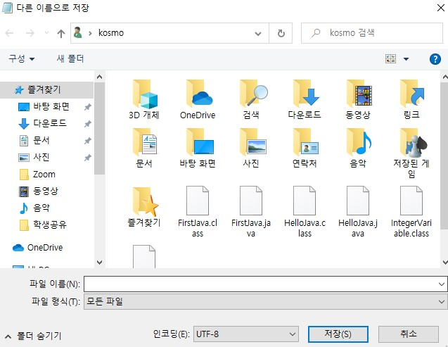

# 2021년 5월 13일 [2일차]

> 오늘 배운것 복습
#

- JDK 설치

  [**자바**에서 - https://java.com/ko/download/](https://java.com/ko/download/)
  
  [**오라클**에서 - https://www.oracle.com/kr/java/technologies/javase-downloads.html](https://www.oracle.com/kr/java/technologies/javase-downloads.html)
  

#


> 참고용
> 
> - Java® Development Kit Version 16 Tool Specifications
>   
>   [Java® Development Kit Version 16 Tool Specifications](https://docs.oracle.com/en/java/javase/16/docs/specs/man/index.html)


#

## 실습 1 

```java
// package hello;

public class HelloJava {

    public static void main(String[] args) {
	System.out.println("Hello, Java");
   }
}
```




- 메모장에서 작성을 하고 **저장**한다.

- 저장할때 **파일이름**은 `class 이름.java` 로 한다.

- **파일형식**은 `모든파일` 로 변경한다.

- **저장루트**는 `C:\Users\kosmo` 로 지정하였다.


#

### 저장 후 

- `윈도우키+R`로 실행창 실행 후 `cmd` 실행.

- `dir * 검색내용` : 현재 드라이브에서 검색내용에 해당하는 파일 검색.

- 작성한 `xxxx.java` 파일이 검색 된다.

```cmd
C:\Users\kosmo>dir *.java
 C 드라이브의 볼륨에는 이름이 없습니다.
 볼륨 일련 번호: 0AF6-563C

 C:\Users\kosmo 디렉터리

2021-05-13  오후 05:02               139 HelloJava.java
               1개 파일                 139 바이트
               0개 디렉터리  184,503,525,376 바이트 남음
```

- `javac xxxx.java` 명령을 하여 컴파일 해준다.   
> javac - read Java class and interface definitions and compile them into bytecode and class files  

```cmd
C:\Users\kosmo>javac Hellojava.java
```


- 에러없이 컴파일이 완료되었다면 `java xxxx`를 명령하여 실행해본다.  
> java - launch a Java application  

```cmd
C:\Users\kosmo>java HelloJava
Hello, Java
```

- 올바르게 실행되는것을 볼 수 있다.


----
## 실습 2  
**실습 1** 을 바탕으로 다른 응용도 실습해본다.


```java
// package hello;

public class FirstJava {

    public static void main(String[] args) {
	System.out.println("Hello, Java");
	System.out.println("안녕하세요 자바");
	System.out.println("반가워요 자바");
	System.out.println("행복해요");
	System.out.println("                 끝!");
   }
}
```  

- `javac FirstJava.java` 명령을 하여 컴파일 해준다.  

- **🔥주의🔥 한글이 들어갈 경우 윈도우 메모장 `인코딩`항목에서 `ANSI`로 바꾸어 주어야 한다.**

- **메모장에서 `인코딩` 항목을 `UTF-8`로 설정한 경우 아래와 같음.**


```cmd
C:\Users\kosmo>javac FirstJava.java
FirstJava.java:7: error: unmappable character (0xEC) for encoding x-windows-949
        System.out.println("?븞?뀞?븯?꽭?슂 ?옄諛?");
                            ^
FirstJava.java:7: error: unmappable character (0xEB) for encoding x-windows-949
        System.out.println("?븞?뀞?븯?꽭?슂 ?옄諛?");
                              ^
FirstJava.java:7: error: unmappable character (0xED) for encoding x-windows-949
        System.out.println("?븞?뀞?븯?꽭?슂 ?옄諛?");
                                ^
FirstJava.java:7: error: unmappable character (0xEC) for encoding x-windows-949
        System.out.println("?븞?뀞?븯?꽭?슂 ?옄諛?");
```

- `ANSI`로 바꾼 후 재컴파일 후 결과값.

```cmd
C:\Users\kosmo>java FirstJava
Hello, Java
안녕하세요 자바
반가워요 자바
행복해요
                 끝!
```


----

## 실습 3


```java
// package hello;

public class FirstJava {

    public static void main(String[] args) {
	System.out.println("Hello, Java");
	System.out.println("안녕하세요 자바");
	System.out.println("반가워요 자바");
	System.out.print("행복해요");
	System.out.println("                 끝!");

   }
}
```

- 결과값

```cmd
C:\Users\kosmo>java FirstJava
Hello, Java
안녕하세요 자바
반가워요 자바
행복해요                 끝!
```

- `System.out.println`  
- `println` 에서 `ln` 을 제외시켜 `print`만 실행하면 라인피드가 달라진다.


----

## 실습 4


```java
// package hello;

public class FirstJava {

    public static void main(String[] args) {
	System.out.println("Hello, Java");
	System.out.println("안녕하세요 자바");
	System.out.println("반가워요 자바");
	// System.out.print("행복해요");
	// System.out.println("                 끝!");

   }
}
```

- 결과값

```cmd
C:\Users\kosmo>java FirstJava
Hello, Java
안녕하세요 자바
반가워요 자바
```

- `//`를 앞에 붙여주게 되면 주석처리가 되어 결과값에서 출력되지 않는다.


