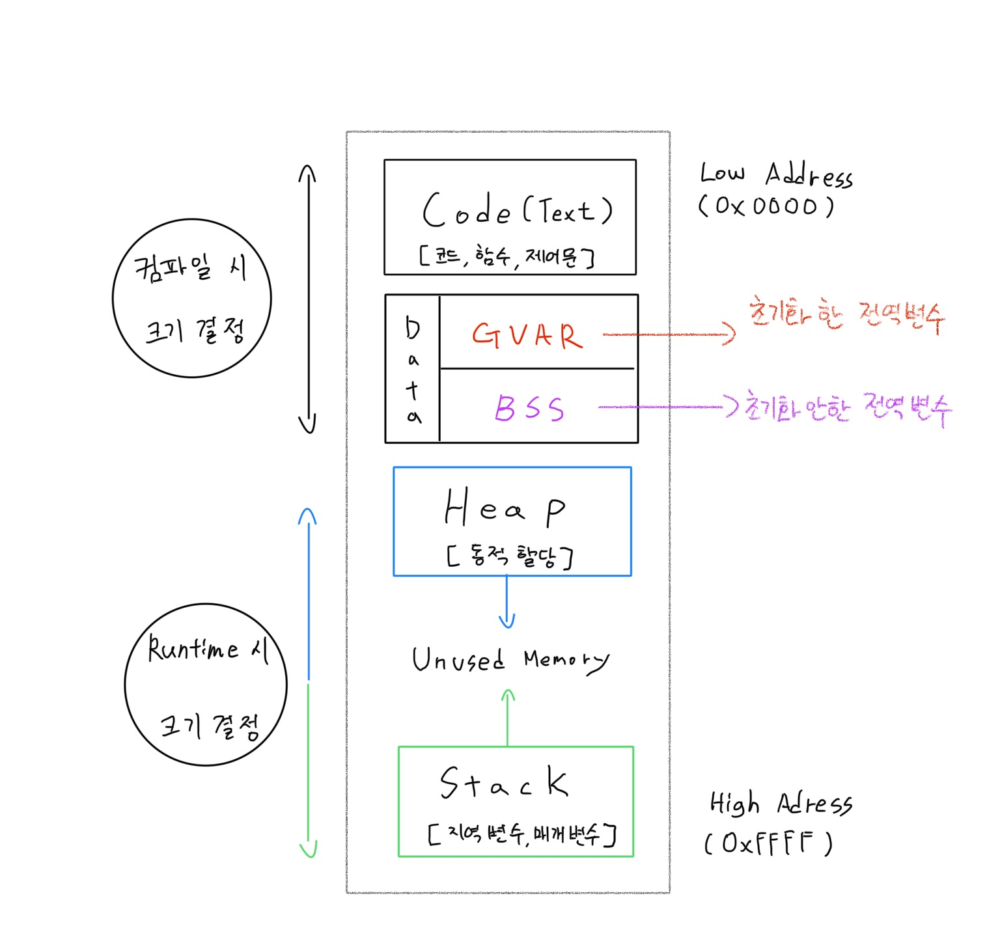

# 2021년 5월 15일 [과제 겸 공부]

## [OS] 메모리 
  
- Process 실행을 위한 핵심요소는 CPU 와 Memory이다.  

- 그 중 Memory는 프로세스 가 프로그램을 구동하기 위해서 각 데이터 상태를 적재하는 공간이다.  

- 이러한 공간에도 각각의 영역이 존재한다.  

  - Code (Text) 영역  

  - Data (BSS, GVAR) 영역  

  - Heap 영역  

  - Stack 영역  

> 영역은 각각의 특징을 가지고 있다.

#

### # Code(Text) 영역  

- Code(Text) 영역은 실행명령을 포함하는 프로그램의 코드가 저장되는 영역. 

- CPU가 이 영역에 저장된 명령어를 처리함.  

- 읽기 전용 영역이기에 함부로 변경할 수 없고 변경 시 오류 발생.  

- 컴퓨터가 이해할 수 있게 컴파일한 `기계어`로 번역된 소스코드가 들어가는 영역.  

- 컴파일 시 크기가 결정됨.  

### # Data (BSS, GVAR)영역  

- `전역변수(global), 정적변수(static), 정적배열, 정적구조체` 등의 영역.

- 프로그램 시작과 동시에 데이터가 적재.

- 프로그램 종료되면 사라진다(반환된다).

- 프로그램이 종료될 때까지 데이터가 남아 다른 함수에서도 사용 가능.

- 세부로 `BSS`와 `GVAR`로 나뉘어진다.
  -	`BSS 영역` : 초기화되지 않은 데이터 저장
  -	`GVAR 영역` : 초기화된 데이터 저장

    - BSS, GVAR 구분하는 이유 :  
    
       초기화 된 데이터는 초기 값을 rom에 저장해야 함.  
       Rom 사이즈가 한정적이므로 초기화 되지 않은 데이터는 Ram에 저장.  

- 컴파일 시 크기가 결정됨.

----  

## [OS] 프로세스
