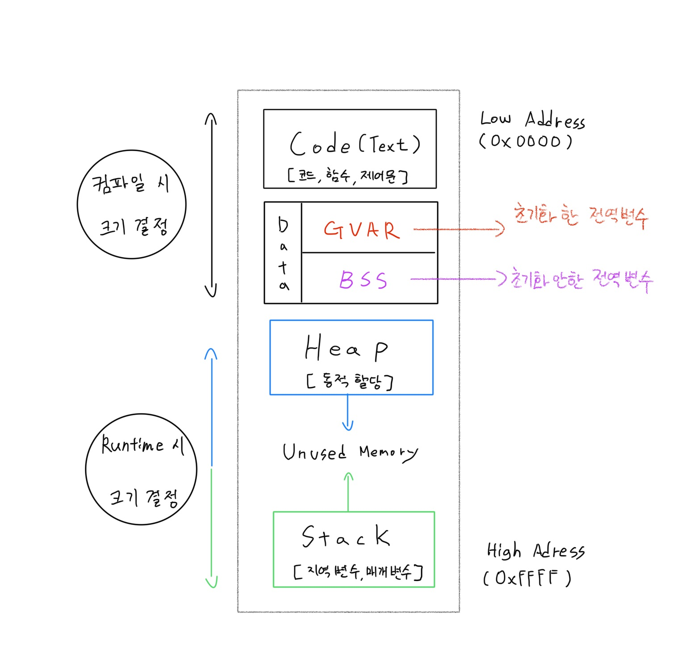
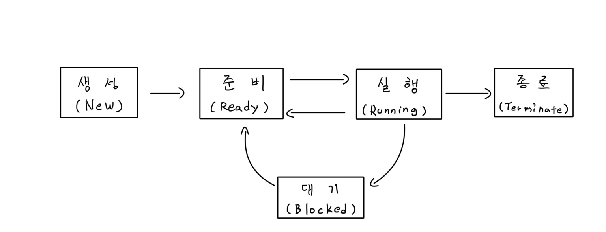
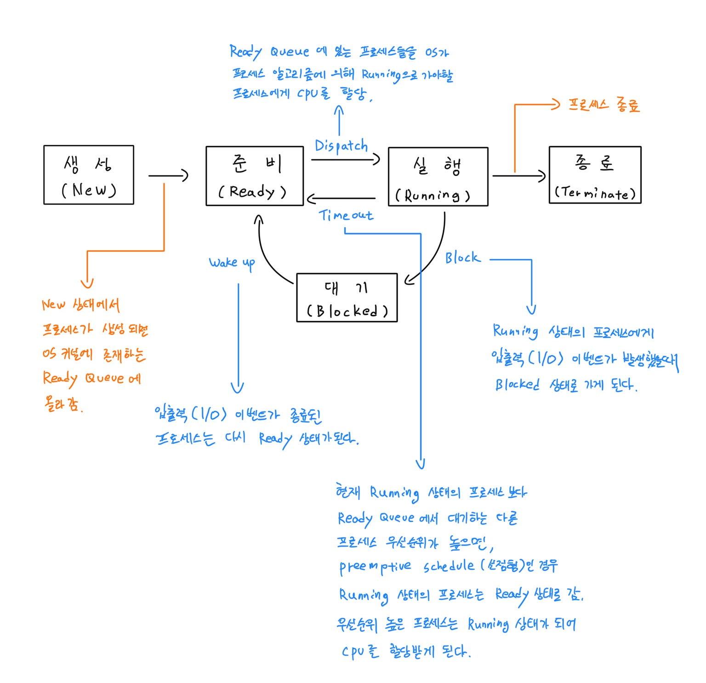

# 2021년 5월 15일 [과제 겸 공부]

## [OS] 메모리 
  
- Process 실행을 위한 핵심요소는 CPU 와 Memory이다.  

- 그 중 Memory는 프로세스 가 프로그램을 구동하기 위해서 각 데이터 상태를 적재하는 공간이다.  

- 이러한 공간에도 각각의 영역이 존재한다.  


  - Code (Text) 영역  

  - Data (BSS, GVAR) 영역  

  - Heap 영역  

  - Stack 영역  

> 영역은 각각의 특징을 가지고 있다.

#

### # 메모리 영역

  


### # Code(Text) 영역  

- Code(Text) 영역은 실행명령을 포함하는 프로그램의 코드가 저장되는 영역. 

- CPU가 이 영역에 저장된 명령어를 처리함.  

- 읽기 전용 영역이기에 함부로 변경할 수 없고 변경 시 오류 발생.  

- 컴퓨터가 이해할 수 있게 컴파일한 `기계어`로 번역된 소스코드가 들어가는 영역.  

- 컴파일 시 크기가 결정됨.  

#

### # Data (BSS, GVAR)영역  

- `전역변수(global), 정적변수(static), 정적배열, 정적구조체` 등의 영역.

- 프로그램 시작과 동시에 데이터가 적재.

- 프로그램 종료되면 사라진다(반환된다).

- 프로그램이 종료될 때까지 데이터가 남아 다른 함수에서도 사용 가능.

- 세부로 `BSS`와 `GVAR`로 나뉘어진다.
  -	`BSS 영역` : 초기화되지 않은 데이터 저장
  -	`GVAR 영역` : 초기화된 데이터 저장

    - `BSS, GVAR 구분하는 이유` :  
    
       초기화 된 데이터는 초기 값을 rom에 저장해야 함.  
       Rom 사이즈가 한정적이므로 초기화 되지 않은 데이터는 Ram에 저장.  

- 컴파일 시 크기가 결정됨.

#

### # Heap 영역  

- New, malloc 등 동적 할당 객체 영역.

- 필요에 의해 메모리를 동적으로 할당할 때 사용.  
= 사용자에 의해 메모리 사용가능(원하는 시점에서 메모리를 할당 : 동적할당) 영역.

- C 언에 예시   
  - malloc() : 메모리 공간을 힙 영역에 할당.  
  - free() : malloc()에 의해 할당된 메모리 공간 소멸.  
  - realloc() : 힙 영역안에 이미 할당 된 변수의 메모리 공간을 변경.  

- Heap에서 오류로 인하여 `[메모리 누수현상 – Memory Leak]` 발생하여 `Garbage`생성.  
- 누수현상 방지를 위해 `메모리 반환`을 해주어야 한다.  
- C C++은 메모리 관리를 개발자야 하여야 함.  
- C# JAVA는 해당언어 가상머신들이 관리함. (Garbage Collection 지원)  


- 특징 : Heap과 Stack은 같은 공간을 공유.

  ```서브루틴 시작 -> 지역변수 적재 -> 서브루틴 끝나면 소멸. = 용량에 대한 불확실성.```

  ```
  Heap은 낮은 주소부터 할당.  

  Stack은 높은 주소부터 할당.  
  ```

- 각 영역이 상대 공간 침범 가능. 

  ```
  Stack overflow : Stack 영역이 Heap 영역을 침범  

  Heap overflow : Heap 영역이 Stack 영역을 침범
  ```

- 런타임 시 크기 결정됨.

#

### # Stack 영역  

- 호출되는 함수의 지역변수, 매개변수가 적재되는 영역.

- 함수 호출 시 생성되어 적재되고, 함수가 종료되면 반환.

- 런타임 시 크기 결정됨.

- 프로세스가 메모리에 로드 될 때 사이즈가 고정되어 런타임 시 사이즈를 바꿀 수 없다.

- 특징 : `LIFO(List In First Out)`
  ```
  가장 마지막으로 저장된 데이터가 가장 먼저 인출된다.  
  
  다른 메모리 영역과 다르게 높은 메모리 주소에서 낮은 메모리 주소의 순서로 할당.  
  ```  
  
- `Call Stack` : 현재 실행중인 함수에 대한 정보를 저장하는 스택자료구조 -> `Debug`를 통해 확인 가능

----


----  

## [OS] 프로세스  

- 프로세스(Process)란 실행 중에 있는 프로그램(Program)을 의미한다.

- 디스크에 있던 프로그램을 메모리에 적재.

- 프로세스 하나당 code, data, heap, stack 영역이 존재한다.

- 운영체제 제어를 받는 상태로 전환되는 것.

#

### # 프로세스의 구분

> 프로세스는 역할과 병행수행방법에 따라 구분된다.

<table  border="1" cellspacing="0">
  <tr width="20px" height="30px" align="center">
    <td colspan="2">역할에 따라
    </td>
    <td colspan="2">병행수행 방법에 따라
    </td>
  </tr>
  <tr width="100px" height="50px" align="center">
    <td>시스템(커널) 프로세스
    </td>
    <td>사용자 프로세스
    </td>
    <td>독립 프로세스
    </td>
    <td>협력 프로세스
    </td>  
  </tr>
  <tr width="100px" height="200px" align="left">
    <td width="300px">모든 시스템 메모리와 프로세서의 명령에 엑세스 할 수 있는 프로세서. 실행 순서를 제어 및 커널 영역을 침범하지 못하게 감시한다. 사용자 프로세스를 생성하는 기능도 포함.  
    </td>
    <td width="300px">사용자 코드를 수행하는 프로세스.
    </td>
    <td width="300px">다른 프로세스에 영향을 주고받지 않으면서 수행하는 병행 프로세스.
    </td>
    <td width="300px">협력 프로세스다른 프로세스에 영향을 주고받는 병행 프로세스.
    </td>  
  </tr>
</table>

#

### # 프로세스 제어 블록(PCB, Process Control Block)  

- 프로세스 제어 블록은 특정한 프로세스를 관리할 필요가 있는 정보를 포함하는 운영 체제 커널의 자료 구조.  

- 작업 제어 블록(TCB, Task Control Block) = (작업 구조)  

- PCB는 운영 체제가 프로세스를 표현한 것

> 프로세스가 생성되면 메모리에 PCB를 생성하고, 프로세스가 실행을 종료하면 PCB도 삭제한다.

#

> 일반적인 항목들은 동일하다.
> 
> 운영체제에 따라 PCB에 포함되는 항목이 다를 수 있다. 
 

- 프로세스 식별자(Process ID)  

- 프로세스 상태(Process State) : 생성(create), 준비(ready), 실행(running), 대기(waiting), 완료(terminated) 상태가 있다. 
  - 유예준비상태(suspended ready), 유예대기상태(suspended wait) 는 스택이 아닌 disk에 저장된다.

- 프로그램 계수기(Program Counter) : 프로그램 계수기는 이 프로세스가 다음에 실행할 명령어의 주소를 가리킨다.

- CPU 레지스터 및 일반 레지스터

- CPU 스케줄링 정보 : 우선 순위, 최종 실행시각, CPU 점유시간 등

- 메모리 관리 정보 : 해당 프로세스의 주소 공간 등

- 프로세스 계정 정보 : 페이지 테이블, 스케줄링 큐 포인터, 소유자, 부모 등

- 입출력 상태 정보 : 프로세스에 할당된 입출력장치 목록, 열린 파일 목록 등

#

- PCB의 위치
```
  PCB가 프로세스의 중요한 정보를 포함하고 있다.
  
  일반 사용자가 접근하지 못하도록 보호된 메모리 영역 안에 남는다.
  
  일부 운영 체제에서 PCB는 커널 스택의 처음에 위치한다. (이 메모리 영역은 편리하면서도 보호를 받는 위치이기 때문)
```

#

### # 프로세스의 상태변화와 상태 정보

> 프로세스는 실행되면서 상태가 시시각각 변한다.




- 생성(New) : 프로세스가 생성 중

  - 프로세스가 생성되었지만 실행가능한 프로세스 집합에 소속되지 못한 상태 
  - 메모리에 적재되지 않은 상태  


- 준비(Ready) : 프로세스가 설정되어 대기중
  -	CPU를 할당받기 위해 준비중인 상태
  -	물리적인 메모리에 적재된 상태


- 실행(Running) : 프로세스가 실행중인 상태
  -	프로세스가 CPU할당받아 기계어 명령 수행중인 상태   


- 대기(Block, wait, sleep) : 프로세스가 사건이 발생하기를 기다리고 있는 상태
  -	바로 CPU할당해주어도 instruction을 수행 할 수 없는 상태.    
  -	오래 걸리는 작업을 하고 있거나, 다른 프로세스 진행을 위해 일부러 재워 둔 상태.


- 종료(Exit, Terminate) : 프로세스가 실행 종료된 상태.
  -	프로그램이 메모리에서 해제된 상태
   

### #프로세스 상태 전이

-	디스패치(Dispatch) : 준비 -> 실행  
-	타임아웃(Time Out) : 실행 - > 준비  
-	대기(Block) : 실행 -> 대기  
-	깨움(Wake Up) : 대기 -> 준비  



