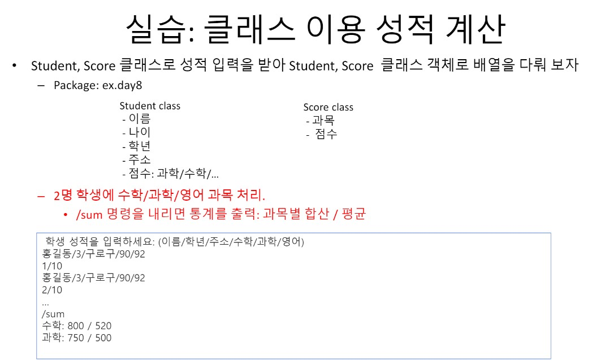

# 2021년 5월 24일 [8일차]

## # 오전수업

### # 1교시 

> 09:30~

- 과제 리뷰.

- 다른 학생들 한것을 참고하고 어떤방식으로 구현 하였는지 해석해보기.

- 알아 듣지 못하더라도 따라 치면서 최대한 이해 해보기.



> 다시 해보기.

#

> 10:30~

- 개인 복습시간.

> 클래스 이용 성적계산을 다른분걸 참고하여 다시 해보았습니다.

#

> 11:30~

모스부호.

ASCII 코드. 부호표기.


> 실습 해보기.

```java
package com.java.ex_ing;

import java.util.Iterator;
import java.util.Scanner;

public class Training20210524 {

	public static void main(String[] args) {
//배열 연습 , 내가 해본것.
		
	/**	Scanner sc = new Scanner(System.in);
		
		System.out.println("문장, 문자를 입력하세요.");
		String text = sc.nextLine();
	
		String[] morse = { ".-", "-...", "-.-." ,"-..", ".",

			     "..-.", "--.", "....", "..", ".---",

			     "-.-", ".-..", "--", "-.", "---",

			     ".--.", "--.-", ".-.", "...", "-",

			     "..-", "...-", ".--", "-..-", "-.--",

			     "--.." };
		
		String result = "";
		
		for (int i = 0; i < text.length(); i++) {
			
			result += morse[text.charAt(i)-'A' & text.charAt(i)-'a'];

		}
		
		System.out.println("text : " + text);
		System.out.println("morse : " + result);
	 **/

	}

}
```

> 결과가 나오긴 하지만 띄워쓰기에서 에러가 남.


#

> 12:30~

실습 다른사람들 풀이 해석.


```
.indexOf 예제 살펴보기.

.equalsIgnoreCase

.charAt

메소드이름 공부해보기.

```


#

> 13:30~

점심시간.


#

## # 오후수업

> 14:30~

강아지 이름배열 매칭출력.

```java
package com.java.ex_ing;

import java.util.Scanner;

public class ArrayTestDogName {

	public static void main(String[] args) {
		
		Scanner sc = new Scanner(System.in);
		
		String[] krdog = {"곰돌이","복돌이","흰둥이","깨소금","까만콩"};		
		String[] endog = {"Bear","Gift","White","Sesami","Black"};
		
		System.out.println("애완견 이름을 적어주세요.");	
		String name = sc.nextLine();
		
		for (int i = 0; i < 5; i++) {
			
			if(name.equals(krdog[i])) {
				System.out.println("> " + endog[i]);
				break;
			}
//			else {
//				System.out.println("미등록");
//				break;
//			}
			}
		}
		
	}
```


#

> 15:30~

깃헙 데스크탑 사용법.


#

> 16:30~


.gitignore 사용법.


Atom 사용법.
> ctrl + shift + p  
> markdown


#

> 17:30~
 
 
 깃페이지 
 Project site.
 
 
 
 
 
 
 
 
 
 
 
 
 
 
#

> 18:30~


#
