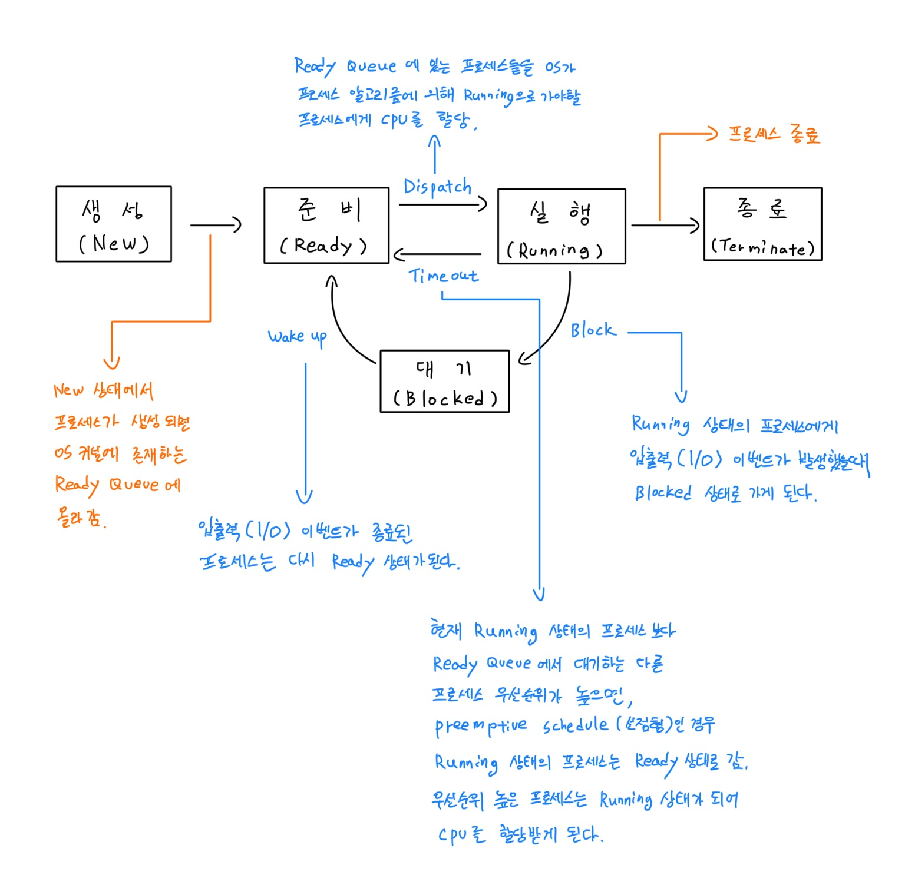
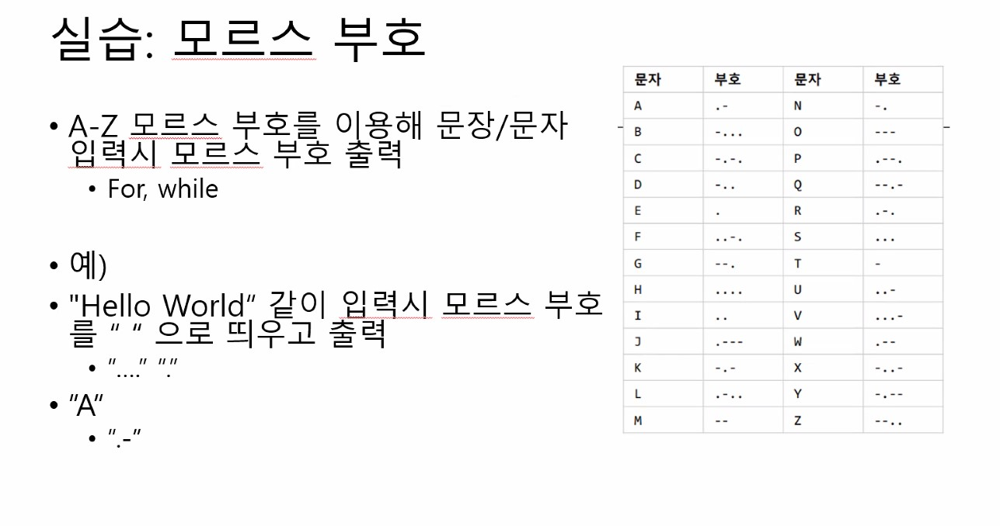

# 2021년 5월 12일 [1일차]

# 1.연습

> 공부 연습용 문장입니다.

> 마크다운 연습.
> 
> 볼드체, 이탤릭체, 링크주소 사용법을 정리함. 
> 
> 추가로 HTML 문법을 사용한 링크도 추가해보았습니다.

- 예제 (Emphasis, Links)

  It's very easy to make some words **bold** and other words *italic* with Markdown. You can even [link to Google!](http://google.com)

- 실습
  
  볼드체를 쓰려면 **이렇게**     `**텍스트** 사용`
  
  이탤릭체를 쓰려면 *이렇게*     `*텍스트* 사용`
  
  링크를 만들려면 [이렇게](http://google.com)   `[텍스트](링크주소) 사용`
  
  HTML 문법 사용한 링크 <a href="https://www.google.com/">www.google.com</a> `<a href="링크주소">텍스트</a>`

  


# 2.연습

> 제목을 `#` 에 따라서 크기가 바뀌는것을 연습했습니다.
> 
> 추가로 HTML에서 `<h1>, <h2>` 를 적용하여 똑같은 적용효과를 확인했습니다.


- 예제 (Headers)

  `# This is an <h1> tag`
  `## This is an <h2> tag`
  `###### This is an <h6> tag`
  
  
- 실습
  
  `# 사용하여 적용`

    # 텍스트
    ## 텍스트
    ###### 텍스트
    
    
- 실습
  
  `<h1>, <h2>, <h6> 사용하여 적용`
  
    <h1> 텍스트
    <h2> 텍스트
    <h6> 텍스트
  
  
# 3. 연습

> 이미지 링크하는것을 연습하였습니다.
> 
> 추가로 HTML 문법으로 똑같이 링크를 연결하는것도 해보았습니다.
> 
> HTML 문법으로 30% 크기 조정도 복습해보았습니다.
 
 
- 예제 (Images)
  
   ``
   
   `Format: `

- 실습

  
  
  HTML 문법으로 만든링크
  
  ` 로 작성함.`
  
  


  HTML 문법으로 30% 크기로 만든링크
  
  ` 로 작성함.`
  
  


# 4. 연습

> 리스트 만드는것을 복습하였습니다.
> 
> `*, +, -` 가 같은 효과인것을 복습했습니다.
> 
> 번호 있는 목록과 번호 없는 목록 두가지를 복습했습니다.

- 예제 (Lists - Unordered)

  `* Item 1`
  `* Item 2`
    `* Item 2a`
    `* Item 2b`

  **`Tip *, +, - 이것들은 같은 효과`**

- 실습
  
  `* 사용하여 작성`
  * 테스트1
  * 테스트2
    * 테스트 2a
    * 테스트 2b

- 실습
  
  `+ 사용하여 작성`
  + 테스트1
  + 테스트2
    + 테스트 2a
    + 테스트 2b
    
- 실습
  
  `- 사용하여 작성`
  - 테스트1
  - 테스트2
    - 테스트 2a
    - 테스트 2b

- 예제 (Lists - Ordered)

  `1. Item 1`
  `1. Item 2`
  `1. Item 3`
    `1. Item 3a`
    `1. Item 3b`

- 실습

1. 테스트 1
1. 테스트 2
1. 테스트 3
  1. 테스트 3a
  1. 테스트 3b

# 5. 연습

> 상대경로, 절대경로를 연습하였습니다.
> 
> `Secondfile.md` 를 추가로 만들고 이미지 파일도 업로드하여 경로를 상호 연결해주었습니다.
 
- 예제 

  `[리스트1 상대경로](Secondfile.md)`
  
  `[리스트1 절대경로](./Secondfile.md)`

- 실습
  - [테스트1 상대경로](Secondfile.md)
  - [테스트1 절대경로](./Secondfile.md)


# 6. 연습

> 마크다운 기타 추가 연습
> 
> 블록인용, 테이블을 추가로 연습해보았습니다.
> 
> 테이블로 셀을 만들고 추가적인 내용을 적용해보았습니다.

- 예제 (Blockquotes)

  As Kanye West said:

  `> We're living the future so`
  `> the present is our past.`

- 실습

  테스트로 작성합니다:
  
  > 이것은 테스트로 작성합니다.
  
  > 테스트 문장입니다.


- 예제 (Tables)

  `First Header | Second Header`

  `------------ | -------------`

  `Content from cell 1 | Content from cell 2`

  `Content in the first column | Content in the second column`


- 실습

  테스트1 | 테스트2
  --------|--------
  테스트 셀1 | 테스트 셀2
  테스트 내용 | 테스트 내용
  1 | 2
  num 1 | num 2
  *image1* | *image2*
   | 

----
----

# 2021년 5월 13일 [2일차]

> 오늘 배운것 복습
#

- JDK 설치

  [**자바**에서 - https://java.com/ko/download/](https://java.com/ko/download/)
  
  [**오라클**에서 - https://www.oracle.com/kr/java/technologies/javase-downloads.html](https://www.oracle.com/kr/java/technologies/javase-downloads.html)
  

#


> 참고용
> 
> - Java® Development Kit Version 16 Tool Specifications
>   
>   [Java® Development Kit Version 16 Tool Specifications](https://docs.oracle.com/en/java/javase/16/docs/specs/man/index.html)


#

## 실습 1 

```java
// package hello;

public class HelloJava {

    public static void main(String[] args) {
	System.out.println("Hello, Java");
   }
}
```


- 메모장에서 작성을 하고 **저장**한다.

- 저장할때 **파일이름**은 `class 이름.java` 로 한다.

- **파일형식**은 `모든파일` 로 변경한다.

- **저장루트**는 `C:\Users\kosmo` 로 지정하였다.


#

### 저장 후 

- `윈도우키+R`로 실행창 실행 후 `cmd` 실행.

- `dir * 검색내용` : 현재 드라이브에서 검색내용에 해당하는 파일 검색.

- 작성한 `xxxx.java` 파일이 검색 된다.

```cmd
C:\Users\kosmo>dir *.java
 C 드라이브의 볼륨에는 이름이 없습니다.
 볼륨 일련 번호: 0AF6-563C

 C:\Users\kosmo 디렉터리

2021-05-13  오후 05:02               139 HelloJava.java
               1개 파일                 139 바이트
               0개 디렉터리  184,503,525,376 바이트 남음
```

- `javac xxxx.java` 명령을 하여 컴파일 해준다.   
> javac - read Java class and interface definitions and compile them into bytecode and class files  

```cmd
C:\Users\kosmo>javac Hellojava.java
```


- 에러없이 컴파일이 완료되었다면 `java xxxx`를 명령하여 실행해본다.  
> java - launch a Java application  

```cmd
C:\Users\kosmo>java HelloJava
Hello, Java
```

- 올바르게 실행되는것을 볼 수 있다.


----
## 실습 2  
**실습 1** 을 바탕으로 다른 응용도 실습해본다.


```java
// package hello;

public class FirstJava {

    public static void main(String[] args) {
	System.out.println("Hello, Java");
	System.out.println("안녕하세요 자바");
	System.out.println("반가워요 자바");
	System.out.println("행복해요");
	System.out.println("                 끝!");
   }
}
```  

- `javac FirstJava.java` 명령을 하여 컴파일 해준다.  

- **🔥주의🔥 한글이 들어갈 경우 윈도우 메모장 `인코딩`항목에서 `ANSI`로 바꾸어 주어야 한다.**

- **메모장에서 `인코딩` 항목을 `UTF-8`로 설정한 경우 아래와 같음.**


```cmd
C:\Users\kosmo>javac FirstJava.java
FirstJava.java:7: error: unmappable character (0xEC) for encoding x-windows-949
        System.out.println("?븞?뀞?븯?꽭?슂 ?옄諛?");
                            ^
FirstJava.java:7: error: unmappable character (0xEB) for encoding x-windows-949
        System.out.println("?븞?뀞?븯?꽭?슂 ?옄諛?");
                              ^
FirstJava.java:7: error: unmappable character (0xED) for encoding x-windows-949
        System.out.println("?븞?뀞?븯?꽭?슂 ?옄諛?");
                                ^
FirstJava.java:7: error: unmappable character (0xEC) for encoding x-windows-949
        System.out.println("?븞?뀞?븯?꽭?슂 ?옄諛?");
```

- `ANSI`로 바꾼 후 재컴파일 후 결과값.

```cmd
C:\Users\kosmo>java FirstJava
Hello, Java
안녕하세요 자바
반가워요 자바
행복해요
                 끝!
```


----

## 실습 3


```java
// package hello;

public class FirstJava {

    public static void main(String[] args) {
	System.out.println("Hello, Java");
	System.out.println("안녕하세요 자바");
	System.out.println("반가워요 자바");
	System.out.print("행복해요");
	System.out.println("                 끝!");

   }
}
```

- 결과값

```cmd
C:\Users\kosmo>java FirstJava
Hello, Java
안녕하세요 자바
반가워요 자바
행복해요                 끝!
```

- `System.out.println`  
- `println` 에서 `ln` 을 제외시켜 `print`만 실행하면 라인피드가 달라진다.


----

## 실습 4


```java
// package hello;

public class FirstJava {

    public static void main(String[] args) {
	System.out.println("Hello, Java");
	System.out.println("안녕하세요 자바");
	System.out.println("반가워요 자바");
	// System.out.print("행복해요");
	// System.out.println("                 끝!");

   }
}
```

- 결과값

```cmd
C:\Users\kosmo>java FirstJava
Hello, Java
안녕하세요 자바
반가워요 자바
```

- `//`를 앞에 붙여주게 되면 주석처리가 되어 결과값에서 출력되지 않는다.

----
----

# 2021년 5월 14일 [3일차]  
> 배운것 복습.  
#

## 오전수업

```java
//package hello;
//공백: white space ( 줄바꿈, 스페이스, 탭...)
public class HelloJava {
	public static void main(String[] args) {
		System.out.println("Hello, Java");
		System.out.println("안녕, java");
	}
}
```
> 공백(white space)는 줄바꿈, 스페이스, 탭 등으로 설정 해줄수 있다.


```java
/* package hello;
 공백: white space ( 줄바꿈, 스페이스, 탭...) */

public class HelloJava {
	public static void main(String[] args) {
		System.out.println("Hello, Java");
		System.out.println("안녕, java");
	}
}
```
> - 주석처리  
>   **한줄** 주석은 `//`로 설정 해줄수 있다.  
>   **영역 전체**를 주석으로 설정하려면 `/*    */`로 묶어서 전체를 설정한다.  

----

```java
/* package hello;
 공백: white space ( 줄바꿈, 스페이스, 탭...) 
*/


public class HelloJava {
/*	public static void main(String[] args) {
		System.out.println("Hello, Java");
		System.out.println("안녕, java");
	} */
}
```  

> 메소드를 주석처리 하였다.

```cmd
C:\Users\kosmo>javac HelloJava.java

C:\Users\kosmo>java HelloJava
Error: Main method not found in class HelloJava, please define the main method as:
   public static void main(String[] args)
or a JavaFX application class must extend javafx.application.Application
```  
> 클래스 안에 메인 메소드가 있어야 한다.  
> 
> 메인 메소드를 주석처리하여도 컴파일에는 이상이 없다.  
> 
> 메인 메소드가 주석처리되어 `java`로 실행 하였을때 에러가 나온다.  
 
> - 결론 : `클래스` 안에 `메인메소드`가 없으면 컴파일은 되지만 실행시 `Error` 출력. 

----

- Tip : `;`(세미콜론) 은 줄막음

----

```java
/* package hello; */
```

- 패키지 부분의 주석처리를 제거하고 `package`가 들어갔을 경우

```cmd
C:\Users\kosmo>javac HelloJava.java

C:\Users\kosmo>java HelloJava
Error: Could not find or load main class HelloJava
Caused by: java.lang.NoClassDefFoundError: hello/HelloJava (wrong name: HelloJava)
```

- 찾을수 없는 것과 동일한 에러가 나온다.

```cmd
C:\Users\kosmo>java HelloJava22
Error: Could not find or load main class HelloJava22
Caused by: java.lang.ClassNotFoundException: HelloJava22
```

- 클래스가 존재하고 보이는데 에러가 나옴, 가상머신이 인식못하도록 하는 `package` 서브디렉토리 형태로 숨겨짐.

  hello 폴더 밑에 HelloJava가 있다고 인식된다. 

  위치를 제대로 알려줘야한다. class path 설정필요.
  
  소스 충돌 방지를 위해 쓰는것이 `package` 이다.

#

- 컴파일할때 디렉토리 구조로 하는 법

```cmd
C:\Users\kosmo>javac -d . HelloJava.java
```

> `-d .` : 현재 디렉토리로 지시  

#

- 실행방법 (디렉토리 구조로 컴파일 한것을 실행)

```cmd
C:\Users\kosmo>java -cp . hello.HelloJava
Hello, Java
안녕, java
```  
> `-cp . ` : 현재 class path 에서  
> 
> `hello.HelloJava` : `hello.` 폴더 밑의 `HelloJava`를 실행.

----

## 실습

> 패키지 지정 실습

- 메모장에 소스코드 작성.

```java
package kosmo;

public class MyName {
	public static void main(String[] args) {
		System.out.println("내 이름은 Kosmo 입니다");
	}
}
```
 
- `cmd`에서 `javac`로 컴파일 후 `java`로 실행.

```cmd
C:\Users\kosmo>javac -d . MyName.java

C:\Users\kosmo>java -cp . kosmo.MyName
내 이름은 Kosmo 입니다

```

`C:\Users\kosmo` 밑에 `kosmo` 폴더가 생성되고 그 밑에 `MyName.class` 가 생성 됨.

올바르게 출력되는것을 볼 수 있다.

> -d : package에서 정한 디렉토리 생성  
> -cp : classpath 클래스 위치 지정  
> `.` 현재디렉토리를 지시.

#

`C:\Users\kosmo>cd`

> 현재 디렉토리 위치 및 이동

```cmd
C:\Users\kosmo>cd "My Documents"

C:\Users\kosmo\My Documents>
```

#

- 다른 디렉토리에서 자바를 실행

`.` 현재 디렉토리를 지시. `..` 한단계 전 디렉토리를 지시.

```cmd
C:\Users\kosmo\My Documents>java -cp ..\
```

> kosmo 위치를 지칭한것이다.


```cmd
C:\Users\kosmo\My Documents>java -cp ..\ kosmo.MyName
내 이름은 Kosmo 입니다
```  
> 올바르게 출력되는것을 확인 할 수 있다.

#


- 절대경로

> 리눅스는 ` / (슬래시)` 기반

> 윈도우는 디스크 기반 `C:`

```cmd
C:\Users\kosmo\My Documents>java -cp C:\Users\KOSMO kosmo.MyName
내 이름은 Kosmo 입니다
```

> 절대경로로 실행해도 잘 출력 됨.

----

## 커맨드라인  

> 커맨드 명령어 연습. 

`dir` : 현재 폴더에 있는 목록을 확인(directory)

`cd` : 디렉토리 변경(change directory) 

`.` : 현재 위치

`..` : 앞의 위치

`dir c:\` : 절대경로

`md` = `mkdir` : (디렉토리 생성)    


```cmd
C:\Users\kosmo\My Documents>md /?
디렉터리를 만듭니다.

MKDIR [드라이브:]경로
MD [드라이브:]경로

명령 확장을 사용하면 MKDIR은 아래와 같이 바뀝니다.

필요한 경우 MKDIR은 경로 상에 중간 디렉터리를 만듭니다.
예를 들어, \a가 없다고 가정하면

    mkdir \a\b\c\d

는 확장을 사용하지 않는 경우의

    mkdir \a
    chdir \a
    mkdir b
    chdir b
    mkdir c
    chdir c
    mkdir d

와 같습니다.  
```  
> cmd에서  `md /?` 사용법 보았다.

#

```cmd
C:\Users\kosmo\My Documents>md Sample\A\B\C
```

> Sample 만들고 그밑에 하위폴더 A B C 하위로 생성.  
> `md Sample\A\B\C`

#

>  단순 폴더 생성.  
>  `md 폴더명`

#

> 상위 폴더 이동.  
> `cd ..` 

#


```cmd

❗️ 여러번 한꺼번에 이동 ❗️ 

C:\Users\kosmo\My Documents\sample\A\B\C>cd ..\..\..\..\

C:\Users\kosmo\My Documents>


❗️ 절대경로 이동 ❗️

C:\Users\kosmo\My Documents>cd "\Users\KOSMO\My Documents\sample\A\B\C"

C:\Users\kosmo\My Documents\sample\A\B\C>

```

> `Tip` **도스**는 대소문자 구문 없고, **파워쉘**은 대소문자 구분 한다.

#

> 파일 삭제  
> `del` `ERASE`  

```cmd
C:\Users\kosmo\Documents>del test
C:\Users\kosmo\Documents\test\*, 계속하시겠습니까(Y/N)? y
```

> `test` 폴더 내 파일을 전부 삭제한다는 의미. (`test` 폴더는 삭제 안함)

#

> `RMDIR` : 디렉토리(폴더)를 삭제

```cmd
C:\Users\kosmo\Documents>rmdir Sample
디렉터리가 비어 있지 않습니다.

C:\Users\kosmo\Documents>rmdir /s Sample
Sample, 계속하시겠습니까(Y/N)? y

C:\Users\kosmo\Documents>dir
 C 드라이브의 볼륨에는 이름이 없습니다.
 볼륨 일련 번호: EA47-CF2A

 C:\Users\kosmo\Documents 디렉터리

2021-05-14  오후 12:03    <DIR>          .
2021-05-14  오후 12:03    <DIR>          ..
2017-10-24  오후 07:13            26,257 Welcome to Cell.cell
2017-10-24  오후 07:20            23,552 Welcome to Hwp.hwp
2019-02-20  오후 05:38           219,962 Welcome to Show.show
2019-02-20  오후 05:31            15,185 Welcome to Word.hwdt
2021-05-12  오후 02:50    <DIR>          Zoom
               4개 파일             284,956 바이트
               3개 디렉터리  181,963,366,400 바이트 남음
```

하위 폴더가 존재할 때 `RMDIR`을 사용하면 `디렉터리가 비어 있지 않습니다.` 출력.

`/s` 사용하여 하위폴더까지 삭제.

#

- 바탕화면에 폴더 생성

```cmd
C:\Users\kosmo>mkdir Desktop\Work
```

#

- 자바 파일 찾기

```cmd
C:\Users\kosmo>dir *.java
 C 드라이브의 볼륨에는 이름이 없습니다.
 볼륨 일련 번호: EA47-CF2A

 C:\Users\kosmo 디렉터리

2021-05-14  오전 10:51               167 HelloJava.java
2021-05-14  오전 11:07               138 MyName.java
               2개 파일                 305 바이트
               0개 디렉터리  181,961,322,496 바이트 남음

C:\Users\kosmo>dir /s *.java
```

> `/s` 는 하위까지 찾게 해줌

#

`move` : 파일을 이동

```cmd
C:\Users\kosmo>move *.java Desktop\Work
C:\Users\kosmo\HelloJava.java
C:\Users\kosmo\MyName.java
        2개 파일을 이동했습니다.
```  
> `*.java`를 사용하여 java 항목들을 모두 이동

#

```cmd
C:\Users\kosmo>rmdir /s hello kosmo
hello, 계속하시겠습니까(Y/N)? y
kosmo, 계속하시겠습니까(Y/N)? y
```

> 하위 폴더까지 여러개 삭제.  

> ⚠️휴지통에 가지 않음으로 주의 필요.⚠️
 


----

## 재실습

> java 파일들을 앞선 커맨드 명령어 연습에서 `move`로 이동함.

> 파일 옮긴 뒤 재 실습.

- 다시 컴파일

```cmd

C:\Users\kosmo\Desktop\Work>javac -d . MyName.java  
C:\Users\kosmo\Desktop\Work>javac -d . HelloJava.java

```

- 다시 java 실행

```cmd
C:\Users\kosmo\Desktop\Work>java -cp . hello.HelloJava
Hello, Java
안녕, java

C:\Users\kosmo\Desktop\Work>java -cp . kosmo.MyName
내 이름은 Kosmo 입니다
```  

## 실습 2

  
메인클래스. 하나의 패키지에서 하나의 클래스.

패키지를 기준으로.

`public` 클래스는 두개이상 들어가면 안됨. `public`은 없어도 무방하긴 함.

패키지 하나에 하나의 클래스.

자바의 버전업에 따라서 달라짐.

버전업에 따라 문법체계가 달라짐.  

#

- 과제 

```
<자바 패키지 실습2>  

• 작업디렉토리: Desktop\Work\   
  – 작업디렉토리: Desktop\Work\mystudent\
  
• Main Class name: MyStudent   
– Package name: kosmo   
– 결과 출력:     
	• “kosmo 학생입니다”  

• Class name: Summary 
– Package name: kosmo

• MyStudent, Summary 컴파일하고 Main class를 실행하시오.  
```

```java

package kosmo;

public class MyStudent {

	public static void main(String[] args) {
		System.out.println("kosmo 학생입니다");
	}
}
```  
> 메모장 소스코드 작성  
>
> 메인클래스 MyStudent 작성한것.

```java

package kosmo;

public class Summary {
	// To do
}

```  
> 클래스 Summary 작성한것.  

```cmd
한꺼번에 컴파일 실행.

C:\Users\kosmo\Desktop\Work>javac -d . MyStudent.java Summary.java
```

> 컴파일이 정상적으로 됨.  

```cmd
C:\Users\kosmo\Desktop\Work>java -cp . kosmo.MyStudent
kosmo 학생입니다
```

> Main class도 정상적으로 실행 됨.

#

- **추천사항**

  에드위드

  위키독

  OS, 

  컴퓨터구조 등 따로 공부해보기

  프로세스 관련. 공부 따로 해보기

#

----


## 오후수업  

- 프로그램실행은 메모리를 할당받는 행위  
- 메모리가 부족하면 대기열 발생  
- OS가 메모리 관리 (Process Management)   
- 모든 io 는 FileSystem에서 관리  
- [jvm 성능관련](https://www.holaxprogramming.com/2017/10/09/java-jvm-performance/)  


- 이클립스 다운  

에디터마다 다름.

Eclipse IDE for Java Developers  
에디터 + J

java SE : 일반사용자용  
java EE : 엔터프라이즈용 (보안관련 추가)  

#

- 이클립스 

> 이클립스 설치 후 둘러보기.  


  [이클립스 설치](https://www.eclipse.org/downloads/packages/)  

  컨트롤+스페이스 --> JRE 보조.

  package Expolor 창에서 -> 파일 오른쪽버튼 -> properties -> text file encoding  

  기본은 윈도우용 MS949

  워크스페이스를 유니코드로 미리 해놓으면 다른환경에서 이상이 없음. 

```  
- 설정방법  

  Window -> Preperences -> encoding 검색 -> 각탭 부분에서 text file encoding 부분항목들을 UTF-8로 각각 변경해준다.

```

  ex) 리눅스 환경에서 그대로 사용할수 있음.


#

- 변수  : 저장할 공간의 이름.

```java
이클립스 실습 (변수 선언하여 사용하기) 책 45p

package chapter2;

public class Variable1 {

	public static void main(String[] args) {
		// type : primitive type, object type(class)
		
		int level;			//정수형 변수 level을 선언
		level = 10;			//level 변수에 값 10을 대입
		System.out.println(level);	//level 값 출력

	}

}
```

#

```java
package chapter2;

public class Variable1 {

	public static void main(String[] args) {
		// type : primitive type, object type(class)
		
		int level;			//정수형 변수 level을 선언
		level = 10;			//level 변수에 값 10을 대입
		System.out.println(level);	//level 값 출력

		System.out.println("Hello, Java"); //"Hello, Java" <---객체이다.
		
		//primitive type 을 다 제외하고 숫자이다.
		
//52p 참고
//		String str = "Hello, java";
//		String str = new String("Hello, java")
		//위의 System.out.println("Hello, Java"); 과 같은것 ( 61p 리터럴형 )
		
	}

}

```
#


- level 값을 `//주석처리` 해서 나온 에러.

```java
Exception in thread "main" java.lang.Error: Unresolved compilation problem: 
	The local variable level may not have been initialized

	at chapter2.Variable1.main(Variable1.java:10)
```

> 메모리에 배정된 값이 없어서 생긴 `Exception Error` -> `not have been initialized` 이다.


#

- 추가사항

```java
package chapter2;

public class Variable1 {

	public static void main(String[] args) {
		// type : primitive type, object type(class)
		
		int level;			//정수형 변수 level을 선언
		level = 10;			//level 변수에 값 10을 대입
							//숫자 리터럴
		
		
		System.out.println(level);	//level 값 출력

		System.out.println("Hello, Java"); //"Hello, Java" <---객체이다.
		
		//primitive type 을 다 제외하고 숫자이다.
		
//52p 참고
//		String str = "Hello, java";    //문자 리터럴
//		String str = new String("Hello, java")  // new operator
		
		//위의 두가지랑 System.out.println("Hello, Java");은 같은것 ( 61p 리터럴형 )
		//원래는 new가 들어가야 하지만 ...  (45~46p)
		

		// 2. 변수이름 사용
		int q_level;
		int count100;
		int _master;
		int $won;
		
		int !won;
		
		int 27day;
		int 1abc;
		
		int package;
		int new;
		int class;
	
		
		
		
	}

}
```

> 변수이름 사용항목들 이클립스에서 보면 에러 사항을 볼 수 있다.
> 

#

- 추가설명  

```java
package chapter2;

public class Variable1 {

	public static void main(String[] args) {
		// type : primitive type, object type(class)
		
		int level;			//정수형 변수 level을 선언
		level = 10;			//level 변수에 값 10을 대입
							//숫자 리터럴
		
		
		System.out.println(level);	//level 값 출력

		System.out.println("Hello, Java"); //"Hello, Java" <---객체이다.
		
		//primitive type 을 다 제외하고 숫자이다.
		
//52p 참고
//		String str = "Hello, java";    //문자 리터럴
//		String str = new String("Hello, java")  // new operator
		
		//위의 두가지랑 System.out.println("Hello, Java");은 같은것 ( 61p 리터럴형 )
		//원래는 new가 들어가야 하지만 ...  (45~46p)
		

		/* 2. 변수이름 사용
		int q_level;
		int count100;
		int _master;
		int $won;
		
		int !won;
		
		int 27day;
		int 1abc;
		
		int package;
		int new;
		int class;
		*/ //주석처리를 해제하고 이클립스에서 보면 에러 이유를 확인 할 수 있다.
		
		
		// 의미있는 변수 선업!
		
		/*int ns;					// 학생수
		int numberOfStudent;	// 학생수
		
		int studentIsGraduated; // 졸업여부?
		*/
		
		//소문자로 시작 다음문장 시작 접속어 앞부분은 대문자. ->> 카멜 표기법.
		
	}

}
```

----

## 마지막교시 실습

```java
package hello;

public class SizeOfTypes {

	public static void main(String[] args) {
		// byte -> Byte
		System.out.println("byte 크기: " + (Byte.SIZE/8) + "Bytes"); // primitive type 마다 클래스 크기 정의가 있다.
		// Int -> Integer
		// Short -> Short
		// Long
		// Character
		// Float
		// Double

		System.out.println("Int 크기: " + (Integer.SIZE/8) + "Bytes");
		
		System.out.println("Short 크기: " + (Short.SIZE/8) + "Bytes");
		
		System.out.println("Long 크기: " + (Long.SIZE/8) + "Bytes");
		
		System.out.println("Char 크기: " + (Character.SIZE/8) + "Bytes");
		
		System.out.println("Float 크기: " + (Float.SIZE/8) + "Bytes");
		
		System.out.println("Double 크기: " + (Double.SIZE/8) + "Bytes");
	
		
		// 책 49p 실습.
	}

}
```

- 위의 소스를 실행한 결과 값.

```cmd
C:\Users\kosmo\eclipse-workspace\FirstProject\bin>java -cp . hello.SizeOfTypes
byte 크기: 1Bytes
Int 크기: 4Bytes
Short 크기: 2Bytes
Long 크기: 8Bytes
Char 크기: 2Bytes
Float 크기: 4Bytes
Double 크기: 8Bytes
```

----

과제 (숙제) 

운영체계

1. 메모리  
2. 프로세스  

자료를 찾아 공부하고, 공부한 내용을

각 2장씩 요약 설명.

ppt, word 무방 , 깃허브 페이지링크도 무방

5/16 12:00까지

강사 이메일로 전송

----
----

# 2021년 5월 15일 [과제 겸 공부]

## [OS] 메모리 
  
- Process 실행을 위한 핵심요소는 CPU 와 Memory이다.  

- 그 중 Memory는 프로세스 가 프로그램을 구동하기 위해서 각 데이터 상태를 적재하는 공간이다.  

- 이러한 공간에도 각각의 영역이 존재한다.  


  - Code (Text) 영역  

  - Data (BSS, GVAR) 영역  

  - Heap 영역  

  - Stack 영역  

> 영역은 각각의 특징을 가지고 있다.

#

### # 메모리 영역

  


### # Code(Text) 영역  

- Code(Text) 영역은 실행명령을 포함하는 프로그램의 코드가 저장되는 영역. 

- CPU가 이 영역에 저장된 명령어를 처리함.  

- 읽기 전용 영역이기에 함부로 변경할 수 없고 변경 시 오류 발생.  

- 컴퓨터가 이해할 수 있게 컴파일한 `기계어`로 번역된 소스코드가 들어가는 영역.  

- 컴파일 시 크기가 결정됨.  

#

### # Data (BSS, GVAR)영역  

- `전역변수(global), 정적변수(static), 정적배열, 정적구조체` 등의 영역.

- 프로그램 시작과 동시에 데이터가 적재.

- 프로그램 종료되면 사라진다(반환된다).

- 프로그램이 종료될 때까지 데이터가 남아 다른 함수에서도 사용 가능.

- 세부로 `BSS`와 `GVAR`로 나뉘어진다.
  -	`BSS 영역` : 초기화되지 않은 데이터 저장
  -	`GVAR 영역` : 초기화된 데이터 저장

    - `BSS, GVAR 구분하는 이유` :  
    
       초기화 된 데이터는 초기 값을 rom에 저장해야 함.  
       Rom 사이즈가 한정적이므로 초기화 되지 않은 데이터는 Ram에 저장.  

- 컴파일 시 크기가 결정됨.

#

### # Heap 영역  

- New, malloc 등 동적 할당 객체 영역.

- 필요에 의해 메모리를 동적으로 할당할 때 사용.  
= 사용자에 의해 메모리 사용가능(원하는 시점에서 메모리를 할당 : 동적할당) 영역.

- C 언에 예시   
  - malloc() : 메모리 공간을 힙 영역에 할당.  
  - free() : malloc()에 의해 할당된 메모리 공간 소멸.  
  - realloc() : 힙 영역안에 이미 할당 된 변수의 메모리 공간을 변경.  

- Heap에서 오류로 인하여 `[메모리 누수현상 – Memory Leak]` 발생하여 `Garbage`생성.  
- 누수현상 방지를 위해 `메모리 반환`을 해주어야 한다.  
- C C++은 메모리 관리를 개발자야 하여야 함.  
- C# JAVA는 해당언어 가상머신들이 관리함. (Garbage Collection 지원)  


- 특징 : Heap과 Stack은 같은 공간을 공유.

  ```서브루틴 시작 -> 지역변수 적재 -> 서브루틴 끝나면 소멸. = 용량에 대한 불확실성.```

  ```
  Heap은 낮은 주소부터 할당.  

  Stack은 높은 주소부터 할당.  
  ```

- 각 영역이 상대 공간 침범 가능. 

  ```
  Stack overflow : Stack 영역이 Heap 영역을 침범  

  Heap overflow : Heap 영역이 Stack 영역을 침범
  ```

- 런타임 시 크기 결정됨.

#

### # Stack 영역  

- 호출되는 함수의 지역변수, 매개변수가 적재되는 영역.

- 함수 호출 시 생성되어 적재되고, 함수가 종료되면 반환.

- 런타임 시 크기 결정됨.

- 프로세스가 메모리에 로드 될 때 사이즈가 고정되어 런타임 시 사이즈를 바꿀 수 없다.

- 특징 : `LIFO(List In First Out)`
  ```
  가장 마지막으로 저장된 데이터가 가장 먼저 인출된다.  
  
  다른 메모리 영역과 다르게 높은 메모리 주소에서 낮은 메모리 주소의 순서로 할당.  
  ```  
  
- `Call Stack` : 현재 실행중인 함수에 대한 정보를 저장하는 스택자료구조 -> `Debug`를 통해 확인 가능

----


----  

## [OS] 프로세스  

- 프로세스(Process)란 실행 중에 있는 프로그램(Program)을 의미한다.

- 디스크에 있던 프로그램을 메모리에 적재.

- 프로세스 하나당 code, data, heap, stack 영역이 존재한다.

- 운영체제 제어를 받는 상태로 전환되는 것.

#

### # 프로세스의 구분

> 프로세스는 역할과 병행수행방법에 따라 구분된다.

<table  border="1" cellspacing="0">
  <tr width="20px" height="30px" align="center">
    <td colspan="2">역할에 따라
    </td>
    <td colspan="2">병행수행 방법에 따라
    </td>
  </tr>
  <tr width="100px" height="50px" align="center">
    <td>시스템(커널) 프로세스
    </td>
    <td>사용자 프로세스
    </td>
    <td>독립 프로세스
    </td>
    <td>협력 프로세스
    </td>  
  </tr>
  <tr width="100px" height="200px" align="left">
    <td width="300px">모든 시스템 메모리와 프로세서의 명령에 엑세스 할 수 있는 프로세서. 실행 순서를 제어 및 커널 영역을 침범하지 못하게 감시한다. 사용자 프로세스를 생성하는 기능도 포함.  
    </td>
    <td width="300px">사용자 코드를 수행하는 프로세스.
    </td>
    <td width="300px">다른 프로세스에 영향을 주고받지 않으면서 수행하는 병행 프로세스.
    </td>
    <td width="300px">협력 프로세스다른 프로세스에 영향을 주고받는 병행 프로세스.
    </td>  
  </tr>
</table>

#

### # 프로세스 제어 블록(PCB, Process Control Block)  

- 프로세스 제어 블록은 특정한 프로세스를 관리할 필요가 있는 정보를 포함하는 운영 체제 커널의 자료 구조.  

- 작업 제어 블록(TCB, Task Control Block) = (작업 구조)  

- PCB는 운영 체제가 프로세스를 표현한 것

> 프로세스가 생성되면 메모리에 PCB를 생성하고, 프로세스가 실행을 종료하면 PCB도 삭제한다.

#

> 일반적인 항목들은 동일하다.
> 
> 운영체제에 따라 PCB에 포함되는 항목이 다를 수 있다. 
 

- 프로세스 식별자(Process ID)  

- 프로세스 상태(Process State) : 생성(create), 준비(ready), 실행(running), 대기(waiting), 완료(terminated) 상태가 있다. 
  - 유예준비상태(suspended ready), 유예대기상태(suspended wait) 는 스택이 아닌 disk에 저장된다.

- 프로그램 계수기(Program Counter) : 프로그램 계수기는 이 프로세스가 다음에 실행할 명령어의 주소를 가리킨다.

- CPU 레지스터 및 일반 레지스터

- CPU 스케줄링 정보 : 우선 순위, 최종 실행시각, CPU 점유시간 등

- 메모리 관리 정보 : 해당 프로세스의 주소 공간 등

- 프로세스 계정 정보 : 페이지 테이블, 스케줄링 큐 포인터, 소유자, 부모 등

- 입출력 상태 정보 : 프로세스에 할당된 입출력장치 목록, 열린 파일 목록 등

#

- PCB의 위치
```
  PCB가 프로세스의 중요한 정보를 포함하고 있다.
  
  일반 사용자가 접근하지 못하도록 보호된 메모리 영역 안에 남는다.
  
  일부 운영 체제에서 PCB는 커널 스택의 처음에 위치한다. (이 메모리 영역은 편리하면서도 보호를 받는 위치이기 때문)
```

#

### # 프로세스의 상태변화와 상태 정보

> 프로세스는 실행되면서 상태가 시시각각 변한다.


- 생성(New) : 프로세스가 생성 중

  - 프로세스가 생성되었지만 실행가능한 프로세스 집합에 소속되지 못한 상태 
  - 메모리에 적재되지 않은 상태  


- 준비(Ready) : 프로세스가 설정되어 대기중
  -	CPU를 할당받기 위해 준비중인 상태
  -	물리적인 메모리에 적재된 상태


- 실행(Running) : 프로세스가 실행중인 상태
  -	프로세스가 CPU할당받아 기계어 명령 수행중인 상태   


- 대기(Block, wait, sleep) : 프로세스가 사건이 발생하기를 기다리고 있는 상태
  -	바로 CPU할당해주어도 instruction을 수행 할 수 없는 상태.    
  -	오래 걸리는 작업을 하고 있거나, 다른 프로세스 진행을 위해 일부러 재워 둔 상태.


- 종료(Exit, Terminate) : 프로세스가 실행 종료된 상태.
  -	프로그램이 메모리에서 해제된 상태
   

### #프로세스 상태 전이

-	디스패치(Dispatch) : 준비 -> 실행  
-	타임아웃(Time Out) : 실행 - > 준비  
-	대기(Block) : 실행 -> 대기  
-	깨움(Wake Up) : 대기 -> 준비  





----
----

# 2021년 5월 17일 [4일차]

## 오전수업

### # 이클립스  

- 프로젝트 생성 및 삭제 방법  
- 프로젝트 및 패키지 이름 변경 방법 
    - Refactor 항목에 들어가서 Rename을 해주면 된다.  

#

> 교재 49p  

### # 변수와 메모리 

 - `변수`는 컴퓨터 내부의 메모리 공간에 저장된다.  
 
 - `메모리`는 프로그램이 실행되는 작업공간이다.  

```java
int level = 10;
```  
> 메모리에 4바이트(int형) 공간이 `level`이라는 이름으로 할당됨.  
> 앞으로 이 메모리를 변수 `level`로 사용한다는 뜻.  
> 변수를 연산에 사용, 출력 요구시, 변수 이름을 사용해서 값을 가져온다.  
> 변수를 선언한다는것 = 선언한 변수 이름으로 메모리를 얼마만큼의 크기로 사용하겠다는 뜻.  
> 

#

### # 기본자료형의 종류  
  
- 자바에서는 `기본자료형`, `참조자료형`이 있다.

- 기본자료형은 자바 라이브러리에서 기본으로 제공.

- 얼마만큼의 메모리를 어떻게 사용할것인지가 정해져 있다.

- 기본자료형은 각 자료형이 사용할 공간의 크기, 즉 바이트수가 정해져 있다.

| | 정수형 | 문자형 | 실수형 | 논리형|
|:--:|:-----:|:-----:|:-----:|:------:|
|1바이트|byte|-|-|boolean|
|2바이트|short|char|-|-|
|4바이트|int|-|float|-|
|8바이트|long|-|double|-|


> 자료구조에 따라 형식이 달라진다.

> 1바이트 = 8비트

> 복사 붙여넣기 할때 주의..!    
> 눈에는 같아보이지만 text가 아닌것으로 복사될 경우가 있음.  


#

#### # 정수 자료형

- 정수자료형은 양수, 음수, 0을 나타내는데 사용하는 자료형.

- `byte형`, `short형`, `int형`, `long형` 4가지가 있다.

- 각 자료형은 메모리에서 사용하는 바이트 수와 용도가 다르다.

- 각 정수 자료형에 따라 표현할 수 있는 수의 유효 범위가 있다.

```java
package hello;

public class Variable2 {

	public static void main(String[] args) {
		
		// Byte형: 1 Byte
		byte bs1 = -128;
		byte bs2 = 127;		// 변수값 128을 대입하면 오류가 난다.   
                                        // byte의 범위가 (-128 ~ 127)까지이다.  
		
		// Short : 2 Byte
		short sh1 = 128;		// 범위안의 변수는 올바르게 적용된다.	
		short sh2 = -32768;		
		short sh3 = 32767;		// short의 범위는 (-32768 ~ 32767)까지이다.
		
		// Int
		int int1 = -2147483648;
		int int2 = 2147483647;		// int의 범위는 (-2147483648 ~ 2147483647)까지이다.  
		
		// 그림문자 입력
//		int tttt = 2,147,483,648;
		
		// Long
//		int num1 = 12345678900;		// 표현할수 있는 범위를 넘어서서 오류가 남.  
//		long num2 = 12345678900;	// 자바는 모든 정수값을 기본으로 int형으로 처리하기 때문에.  
                                                // 식별자를 쓰지 않아서 오류가 남.  
		
		long num3 = 12345678900L;	// long형으로 처리하려면 식별자 "L"을 숫자뒤에 붙여서 사용.  
		long num4 = 1L;

		long num5 = 1000;   // 이때 오류가 발생하지 않는 이유는  
                                    // 1000 숫자가 int형 범위를 넘지 않고 int형이 long 형으로 자동으로 형 변환되었기때문.  
                                    // 범위 내부에 있는 값을 사용할때는 식별자가 필요 없다.  
		
		// Char
		char ch1 = 'A';
		char ch2 = 'z';
		
				
	}
}
```

> byte형, short형, int형, long형 정리.

> 모든 정수는 기본으로 int 로 한다.

> 예외적인 부분에서 long 형으로 처리하고싶으면 식별자 L 을 써준다.

#

#### # 문자 자료형

- 컴퓨터는 0과 1로 표현할수 있음.

- 문자 역시 컴퓨터표현으로 0과 1로 나타내야 함.

- 문자를 표현할 정수값의 약속 = `코드값`

- `코드값`을 모아둔것이 `문자세트`

- 문자를 정해진 코드값으로 변환하는것을 `문자인코딩(encoding)`이라고 한다.

- 반대로 코드값을 다시 문자로 변환하는것을 `문자디코딩(decoding)`이라고 한다.

> 가장 기본이되는 문자 인코딩은 `아스키(ASCII)`코드이다.  
> 아스키 코드는 `1바이트`만 사용.

> 복잡한 문자를 표현하기 위해 2바이트 이상을 위한 `유니코드(unicode)` 사용.  
> 아스키 코드를 호환하며 `2바이트`나 그 이상의 조합 표현.

> `char`형은 2바이트 사용.

```java
package hello;

public class CharacterEx1 {

	public static void main(String[] args) {
		//문자형! not 문자열!
		char ch1 = 'A'; // 2B == int
		System.out.println(ch1);      // 문자 출력
		System.out.println((int)ch1); // Casting / 문자에 해당하는 정수값(아스키코드값) 출력
		
		char ch2 = 66;              // 정수값 대입
		System.out.println(ch2);    // 정수값에 해당하는 문자 출력
		
		int ch3 = 67;               
		System.out.println(ch3);        // 문자 정수값 출력
		System.out.println((char)ch3);  // 정수 값에 해당하는 문자 출력

		// 범위  char가 2Byte 2의 15승개 32,768 까지 가능하므로. 유니코드 문자로 32768번의 문자가 출력.
		int ch4 = 32768;
		System.out.println(ch4);
		System.out.println((char)ch4);
		
		int ch5 = 318;
		System.out.println(ch5);
		System.out.println((char)ch5);
	}

}
```

```cmd
A
65
B
67
C
32768
耀
318
ľ
```  
> Console에서 결과 값을 볼 수 있다.

#

**문자형 연습**

```java
package hello;

public class CharacterEx2 {

	public static void main(String[] args) {
		char ch1 = '한';
		char ch2 = '\uD55C'; // (\)백슬래시 = 유니코드의 Escape(회피시퀀스) sequence 이다.
		
		System.out.println(ch1);
		System.out.println(ch2);
		
//		char ch3 = -66;
//		System.out.println(ch3);       // 비정상
		
		int ich = -66;
		System.out.println((char)ich);   // 정상
		
		
	}

}
```

> `\uD55C`는 '한' 이라는 글자의 유니코드 값이고 16진수로 나타낸다.  
> 16진수 숫자 하나가 4비트, '한'이라는 글자 표현하는데 4비트 4개 = 2바이트 사용.
> 

**문자형 연습**

```java
package hello;

public class CharacterEx3 {

	public static void main(String[] args) {
		int a = 65;
		int b = -66;
		
		char a2 = 65;
		//char b2 = -66;  // 문자형 변수에는 음수가 없어서 오류 발생.
		
		System.out.println((char)a);
		System.out.println((char)b);
		System.out.println(a2);

	}

}
```

> 문자형 변수에 음수를 넣으면 오류가 발생.


#

#### # 실수 자료형

- 컴퓨터에서 `부동소수점` 방식으로 실수를 세밀하게 표현인다.

- 실수 자료형에는 `float형`rhk `double형`이 있다.

- 부호비트, 지수부, 기수부 형식으로 되어있다.

> Java에서는 `double형`을 실수 기본으로 사용한다. (더 정밀하게 실수를 표현 가능.)

```java
package hello;

public class DoubleEx1 {

	public static void main(String[] args) {
		double dnum = 3.14;
		float fnum = 3.14F;	// F는 식별자
		
		System.out.println(dnum);
		System.out.println(fnum);
		
		// minus
		double dnum2 = -3.14;  // 부호비트가 있으므로 마이너스도 잘 표현된다.
		float fnum2 = -3.14F;  
		
		System.out.println(dnum2);
		System.out.println(fnum2);
		
		// float to int
		System.out.println("double2long: " + (long)dnum2);  // 캐스팅 되면서 반올림이 일어나지 않음. 되는것도 있기 때문에 주의 필요.
		System.out.println("double2int: " + (int)dnum2);
		System.out.println("double2shot: " + (short)dnum2);
		System.out.println("double2byte: " + (byte)dnum2);
		
//		int i1 = fnum;
//		long l1 = dnum;
		
		// int to float/double
		int i1 = 32768;
		int i2 = 2147483647;	// max
		int i3 = -2147483648;	// min
		
		double dnum3 = i2;
		System.out.println("----------------------");
		System.out.println("dnum3: " + dnum3);
		System.out.println("dnum3: " + (double)i2);
		
		System.out.println("-2147483648: " + (double)i3); // 결과값 뒤에 E9 표현 -> 0이 9개가 있는것이다.
		
	}

}
```

> 교재 57p

```cmd
3.14
3.14
-3.14
-3.14
double2long: -3
double2int: -3
double2shot: -3
double2byte: -3
----------------------
dnum3: 2.147483647E9
dnum3: 2.147483647E9
-2147483648: -2.147483648E9
```
> `float형` 에도 식별자 `F`를 붙여줘야 한다.

#

#### # 논리 자료형

- 변수의 참, 거짓의 값을 나타내는데 사용.

- 종류는 `boolean형` 한가지 이다.

```java
package hello;

public class BooleanEx {

	public static void main(String[] args) {
		boolean isMarried = true;		//boolean 변수를 선언하고 초기화
		System.out.println(isMarried);
		
		//교재 59p
		
		System.out.println("--------------------");
		
		boolean b1 = false;
		boolean b2 = true;
		
		System.out.println("Is true: " + true);
		System.out.println("Is false: " + false);

		b1 = b2;
		System.out.println("b1: " + b1);
		
		
//		i1 = (int) b1;
//		b1 = (boolean) i1;
		
//		byte bt =1;
//		b1 = (boolean)bt;
		
//		System.out.println("b1 <> int " + (int)b1);
		
		//논리적인것이기 때문에 정수로 허용 안한다.
		
		
		
		
		// 값 변경이 안되는 식별자! (변수) => 상수 Constant.
		// 값이 미리/기/사전에 선언을하고 사용하는 목적!
		
		final double PI = 3.14;
		final double PI2 = 3.14;
		
//		1000L; 롱형 리터럴
//		3.14F; float형 
//		'A';
//		1234;
//		true;
//		false;
				// 위의것이 다 리터럴.
		
		
	}

}
```

```cmd
true
--------------------
Is true: true
Is false: false
b1: true
```

> `boolean형` 변수는 true나 false 만 대입할수 있고 결과 값도 true, false로 출력된다.

#

### # 상수와 리터럴


#### # 상수 선언하기

- 변수는 변하는 수.

- 변하지 않는 값을 표현하기 위해 `상수(constant)` 사용.

- `final`예약어를 사용해서 선언한다.

```java
final double PI = 3.14;
final int MAX_NUM = 100;
```

> 상수 이름은 주로 대문자 사용.

> 변하지 않아야 하는 값을 상수로 선언하여 사용한다.
> 

#

#### # 리터럴

> 교재 63p

- 프로그램에서 사용하는 모든 숫자, 문자, 논리값(true, false)을 일컫는 말.

- 리터럴은 변수나 상수 값으로 대입할 수 있다.

#

----

## 오후수업


할당 = 대입

기본형 : 
int i = 1000;
int j;


객체  
new


total = math + 

#

### # 형 변환

> 교재 64p

- 정수와 실수는 컴퓨터 내부에서 표현되는 방식이 다르다.

- 정수와 실수를 더할 때, 그대로 연산할수 없다.

- 하나의 자료형으로 통일 필요. --> 이때 `형 변환(type conversion)`이 이루어진다.

```java
int n = 10;		// int형 변수 n에 정수 값 10을 대입.
double dnum = n;	// int형 변수 n의 값을 double형 변수 dnum에 대입
```  
> 변수 n은 int형이고 dnum은 double형이다.  
> 각 변수의 자료형이 다를때 자료형을 같게 바꾸는것이 형 변환. 

#

#### # 묵시적 형 변환

> 교재 65p

예시

```java
byte bNum = 10;
int iNum = bNum;	
```
> byte형 변수 bNum값을 int형 변수 iNum에 대입함.

#

```java
package hello;

public class ImplicitConversion {

	public static void main(String[] args) {
		byte bNum = 10;
		int iNum = bNum;	// byte형 값이 int형 변수로 대입됨.
		
		System.out.println(bNum);
		System.out.println(iNum);
		
		int iNum2 = 20;
		float fNum = iNum2;	// int형 값이 float형 변수로 대입됨.
		
		System.out.println(iNum);
		System.out.println(fNum);
		
		double dNum;
		dNum = fNum + iNum;
		System.out.println(dNum);

	}

}
```
> byte형 값이 int형 변수로 대입됨.  
> int형 값이 float형 변수로 대입됨.

```cmd
10
10
10
20.0
30.0
```  
> 결과 값.


#

#### # 명시적 형 변환

> 교재 66p~68p

- 묵시적 형 변환과 반대의 경우.

예시  

```java
package hello;

public class ExplicitConversion {

	public static void main(String[] args) {
		double dNum1 = 1.2;
		float fNum2 = 0.9F;
		
		int iNum3 = (int)dNum1 + (int)fNum2;		// 실수가 각각 1 과 0으로 형변환  더하기하면 1이됨.
		int iNum4 = (int)(dNum1 + fNum2);		// 1.2와 0.9를 더한 후(실수연산이 먼저 일어나고) 형변환이 되면 2가 됨.
		System.out.println(iNum3);
		System.out.println(iNum4);
		
		
		// 책 69p 5번 문제
		char ch3 = '\uAE00';
		
		System.out.println("\uAE00: " + ch3);
		System.out.println("\\uAE00: " + ch3);  //역슬래시가 문제로 인식되어 그대로 출력.
		
	}

}
```
  

```cmd
1
2
글: 글
\uAE00: 글
```  
> 이 경우 실수의 소수점 이하 부분이 생략되고 다음처럼 정수 부분만 대입된다.  
> 교재 69p 5번까지 실습한 결과도 추가되어 있다. 


#

### # 기본 연산자

#### 항과 연산자

- 사칙연산 처럼 `연산자 우선순위`가 프로그램에서도 있다.

- 단항 연산자가 가장 높고, 이항, 삼항 연산자 순서이다.

|연산자|설명|연산 예|
|:---:|:--:|:----:|
|단항 연산자| 항이 한개인 연산자| ++num |
|이항 연산자| 항이 두개인 연산자| num1 + num2;|
|삼항 연산자| 항이 세개인 연산자| (5>3)? 1 : 0;|

> 단항 > 이항 > 삼항

# 

#### 대입 연산자

- 변수에 값을 대입하는 연산자.

- 이항 연산자 중 우선순위가 가장 낮은 연산자.

```java
int age = 24;
```  
> 나이를 의미하는 age 변수에 값 24를 대입함.

```java
totalScore = mathScore + engScore;
```
> mathScore 값과 engScore 값을 더하여  
> 총점을 의미하는 totalScore 변수에 대입함.   

#

#### 부호 연산자

- 부호연산자는 `+`, `-` 두가지가 있다.

- 연산에 쓰는 `이항 연산자`이면서 부호를 나타내는 `단항 연산자`이기도 하다.

|연산자|기능|연산 예|
|:---:|:--:|:-----:|
|+|변수나 상수 값을 양수로 만듭니다.|+3|
|-|변수나 상수 값을 음수로 만듭니다.|-3|

```java
package chapter3;

public class test {

	public static void main(String[] args) {
		//책 72p
		
		int num = 10;
		
		System.out.println(+num);  // 값 10이 그대로 출력.
		System.out.println(-num);  // 값 10에 -가 붙어서 -10이 출력되지만 num값이 실제로 바뀐것이 아님.
		System.out.println(num);   // 값 10이 그대로 출력 됨.
		
		num = -num;		   // num 값을 음수로 바꿔서 다시 num에 대입함. 
		System.out.println(num);   // 값 -10이 출력됨.

		//byte
		byte b = 1;
		System.out.println(b);
		System.out.println(-b);
		
		b = -1;
		System.out.println(b);
	}

}
```  
> int 이외에 byte도 대입해서 실행 하여 보았다.

```cmd
10
-10
10
-10
1
-1
-1
```
> 연산자만 쓴다고 값 자체가 음수로 바뀌는것이 아니다.  
> 값 자체를 음수로 바꾸려면 = 연산자(대입 연산자)를 사용하여 값을 대입해야 한다.
> 

#


----

> ## 72p 까지 정리함. 나머지 하여야 함.


----
----

# 2021년 5월 18일 [5일차]

## 오전수업

오전동안 123p 까지 예상

199p 배열

매개변수

```java
public static void main(String[] args) {
		System.out.println("Length: " + args.length);
  
    System.out.println( args[0] );
		System.out.println( args[1] );
		System.out.println( args[2] );
```  
> 인덱스 갯수를 맞춰야 한다.

#

### # 비트연산자

> 83p

비트단위로 연산이 이루어진다.

`&`, `|`, `^`, `~`

|1Byte|0|0|0|0|0|1|0|1|
|:---:|:--:|:--:|:--:|:--:|:--:|:--:|:--:|:--:|
|대상|0|0|0|0|1|0|1|0|
|비트& |0000 0000
|비트| |0000 1111
|비트^ |0000 1111

|1Byte|0|0|0|0|0|1|0|1|
|비트~ |1111 1010

#

#### 비트논리 연산자

연습

```java
package com.java.chapter3;

public class BitOperation {

	public static void main(String[] args) {
		int num1 = 5;	// 2진수 0000 0101
		int num2 = 10;	// 2진수 0000 1010
		
		int result = num1 & num2;	// 0000 0000
		System.out.println("num1 & num2 = " + result); 
		
		result     = num1 | num2;
		System.out.println("num1 | num2 = " + result);
		
		result     = num1 ^ num2;
		System.out.println("num1 ^ num2 = " + result);
		
		result     = ~num1		  ;
		System.out.println("~num1 = " + result);
		
		System.out.println("--------------------");
		
		// 논리 연산자와 비트 논리 연산자 차이
		boolean t = (num1 >+ num2 ) && (num1 >= num2);
		
		// 출력 안됨.
//		t = (num1 & num2 ) && (num1 ^ num2); // 값이 명제계산 되므로 오류. 10 과 4 true? false? 안됨. 
		
		t = ( 5 > 10 ) & ( 10 < 20 ); // false & true : 비트 연산. 출력 됨.
		System.out.println(t);
		
		t = ( 5 < 10 ) & ( 10 < 20 ); // true & true : 비트 연산. 출력 됨.
		System.out.println(t);
		// boolean 값도 비트연산 가능.
	}

}
```

```cdm
num1 & num2 = 0
num1 | num2 = 15
num1 ^ num2 = 15
~num1 = -6
--------------------
false
true
```

#

#### 비트 이동 연산자

> 85p

##### <<연산자

```java
int num = 5;
num << 2;
```
```
num     : `0000 0101`
num<< 2 : `0001 01`00
```
> 왼쪽으로 비트를 이동하는 연산자.  
> 왼쪽 시프트는 그 수만큼 2의 배승이 된다. (2^)

#

##### >>연산자

```java
int num = 10;
num >> 2;
```
```
num       : `0000 1010`  
num>>2    : 00`00 0010`  
```
> 오른쪽으로 비트를 이동하는 연산자.  
> 

#

##### >>>연산자

> `>>연산자`와 동일하게 비트를 오른쪽으로 이동한다.
> 왼쪽에서 채워지는비트값이 부호 비트와 상관없이 무조건 0이 된다.

#

#### 연산자 우선순위  

> 87p


#

> 89p ~ 90p

```java
package com.java.chapter3;

public class Quiz89p90p {

	public static void main(String[] args) {
		
		int num;
		num = -5 + 3 * 10 / 2;
		System.out.println(num);
		
		System.out.println("-------------");
		
		int num11 = 10;
		
		System.out.println(num11);
		System.out.println(num11++);
		System.out.println(num11);
		System.out.println(--num11);
		
		System.out.println("-------------");
		
		int num1 = 10;
		int num2 = 20;
		boolean result;
		
		result = ((num1 > 10) && (num2 > 10));
		System.out.println(result);
		result = ((num1 > 10) || (num2 > 10));
		System.out.println(result);
		System.out.println(!result);
		
		System.out.println("-------------");
		
		int num22 = 2;
		int num33 = 10;
		
		System.out.println(num22 & num33);
		System.out.println(num22 | num33);
		System.out.println(num22 ^ num33);
		System.out.println(~num22);
		
		System.out.println("-------------");
		
		int num44 = 8;
		
		System.out.println(num44 += 10);
		System.out.println(num44 -= 10);
		System.out.println(num44 >>= 2);
		
		System.out.println("-------------");
		// 3항 연산자 81p 참고.
		int num77 = 10;
		int num88 = 20;
		
		int result77 = (num77 >= 10) ? num88 + 10 : num88 - 10;
		System.out.println(result77);
		
		System.out.println("-------------");
		
	}

}
```

```cmd
10
-------------
10
10
11
10
-------------
false
true
false
-------------
2
10
8
-3
-------------
18
8
2
-------------
30
-------------
```

> 오전 11시 22분

#

> 오전 11시 34분  

연습

```java
package com.java.chapter3;

public class StringConcat {

	public static void main(String[] args) {

		// boolean t = true + false;
		
		// new String()
		String s = "";	// 스트링 리터럴
		
		/** 문자열 연산자 '+' 의 쓰임새 **/
		
		System.out.println("1+1 = " + "결과" + (1 +1) ); // (1+1)연산이 됨.
		
		System.out.println("유니코드 = " + "\uADAC"); // 스타트 시퀀스 `\u`
		
		System.out.println("유니코드 escape " + "\\uADAC" ); // 시퀀스 무시는 \하나더 붙인다.
		
		System.out.println(" 정수 + 정수 = " + 5 + 10 ); // 510으로 문자로 인식.
		
		System.out.println(" 정수 + 실수 = " + 5 + 10.9 );
		
		System.out.println(5 + 10.9 + " = 정수 + 실수" );
		
	}

}
```

```cmd
1+1 = 결과2
유니코드 = 궬
유니코드 escape \uADAC
 정수 + 정수 = 510
 정수 + 실수 = 510.9
15.9 = 정수 + 실수  
```  

#

> 교재 512p, 513p, 514p ~ 518p읽기

Scanner 테스트 하기

```java
package com.java.chapter3;

import java.util.Scanner;  //일일이 치지말고 Scanner에서 입력.

public class ScannerTest {

	public static void main(String[] args) {
		
		Scanner scanner = new Scanner(System.in); // Scanner는 기본패키지에 들어있지 않음.
		// new를 써서 Scanner 클래스 생성. ()안에 매개변수 넣음.
		
		
		// java.lang : 패키지 -> 기본패키지에 String같은것.
		// chapter11 기본클래스. 읽어보기
		
		System.out.println("이름:");
		String name = scanner.nextLine( ); // 입력하여 엔터친 문자를 반환.
		System.out.println("직업:");
		String job = scanner.nextLine( ); 
		System.out.println("사번:");
		int num = scanner.nextInt();
		
		System.out.println(name);
		System.out.println(job);
		System.out.println(num);
		
	}

}
```  

```cmd
이름:
박은종
직업:
선생님
사번:
12345
박은종
선생님
12345
```  

> ~ 12:18분 종료. 쉬는시간.  

#

Scanner 연습.

```java
package com.java.chapter3;

import java.util.Scanner;

public class StringTest {

	public static void main(String[] args) {
		
		Scanner scanner = new Scanner(System.in);
		
		
		System.out.println(" a입력 : ");
		String num1 = scanner.nextLine( );
		System.out.println(" b입력 : ");
		String num2 = scanner.nextLine( );
		System.out.println(" c입력 : ");
		String num3 = scanner.nextLine( );
		
		int a = Integer.parseInt(num1);
		int b = Integer.parseInt(num2);
		int c = Integer.parseInt(num3);
		
		System.out.println("합산 : " + (a + b + c));
		System.out.println("평균 : " + ((a + b + c)/3));
	}

}
```

```cmd
 a입력 : 
10
 b입력 : 
20
 c입력 : 
30
합산 : 60
평균 : 20
```  


#  

chapter4   

### # 조건문

> 12:48~  
> 92p ~  

조건문 연습

```java
package com.java.chapter4;

public class ifStatementExam {

	public static void main(String[] args) {
		
		int age = 10;
		
		// 조건1
		if (age >= 8) { // 조건식1
			System.out.println("8살 이상입니다. 학교에 다닙니다.");
		}
		else { // 조건이 false 인 경우.
			System.out.println("8살 미만입니다. 학교에 다니지 않습니다.");
		}
		

	}

}
```

```cdm
8살 이상입니다. 학교에 다닙니다.
```

>


> 13:22 점심시간.  

----

## 오후수업

> 14:30 시작  

5day. 연습.

```java
package com.java.chapter4;

import java.util.Scanner;

public class IfScannertest {

	public static void main(String[] args) {
		
		// 실습2 day4 실습 + 조건문
		
		Scanner scanner = new Scanner(System.in);
		
		System.out.println(" 숫자를 입력하세요 :  ");
		String str = scanner.nextLine( );
		
		int num1 = Integer.parseInt(str);
		
		if ( ( num1 == 0 ) || ( num1 < 0 ) ) {
			System.out.println("안녕~");
		}
		
		else {
			choiceOperation(scanner);
		
		}
	}

	private static void choiceOperation(Scanner scanner) {
		
		System.out.println(" 숫자를 입력하세요 :  ");
		String str = scanner.nextLine( );
		
		int num1 = Integer.parseInt(str);
		
		if ( ( num1 == 0 ) || ( num1 < 0 ) ) {
			System.out.println("안녕~");
		}
		
		else {
			choiceOperation(scanner);
	}
}
}
```
> 반복되게 만든것이 맞는지...?

```cmd
 숫자를 입력하세요 :  
1
 숫자를 입력하세요 :  
2
 숫자를 입력하세요 :  
0
안녕~
```

#

> 96p 

### # if-else if-elas문

> 97p 예제

```java
package com.java.chapter4;

public class IfExample2 {

	public static void main(String[] args) {
		int age = 9;
		int charge;
		
		if(age < 8) {
			charge = 1000;
			System.out.println("취학전 아동입니다.");
		}
		else if(age < 14) {
				charge = 2000;
				System.out.println("초등학생 입니다.");	
		}	
		else if(age < 20) {
			charge = 2500;
			System.out.println("중, 고등학생입니다.");
		}
		else {
			charge = 3000;
			System.out.println("일반인 입니다.");
		}
		
		System.out.println("입장료는 " + charge + "원 입니다.");
	}

}
```

```cmd
초등학생 입니다.
입장료는 2000원 입니다.
```

#

pdf 자바 기본프로그래밍 예제

```java
package com.java.chapter4;

import java.util.Scanner;

public class IfExample3 {

	public static void main(String[] args) {
		// 예제]
		//숫자를 입력받아
		//숫자가 0보다 크면 “양수” 영보다 작으면 “음수” 0일때는 “0입니다.”을 출력하세요
		
		Scanner scanner = new Scanner(System.in);
		
		System.out.println(" 숫자를 입력하세요 :  ");
		String str = scanner.nextLine( );
		
		int num1 = Integer.parseInt(str);
		
		if ( num1 > 0 ) {
			System.out.println("양수");
		}
		else if ( num1 < 0 ) {
			System.out.println("음수");
		}
		else {
			System.out.println("0입니다.");
		}
	}
}
```  
> 각각의 조건에 맞게 숫자를 입력하면 올바른 결과를 볼 수 있다.

> ~ 15:20

#

> 15:30 ~

### # switch-case문

> 101p ~ 

```java
package com.java.chapter4;

public class SwitchCase {

	public static void main(String[] args) {
		
		
		int ranking = 1;
		char medalColor;
		
		switch(ranking) {
		case 1 : medalColor = 'G';
				break;
		case 2 : {
			medalColor = 'S';		
			break;					// 코드블럭을 해도 무방하다.
		}							
		case 3 : medalColor = 'B';
				break;
		default:
				medalColor = 'A';
		}
		System.out.println(ranking + "등 메달의 색깔은 " + medalColor + "입니다.");
	}

}
```

```cmd
1등 메달의 색깔은 G입니다.
```  

위의것을 if 문으로 똑같이 작성하면 이렇게 된다.

```java
package com.java.chapter4;

public class SwitchCaseIf {

	public static void main(String[] args) {
		
		int ranking = 1;
		char medalColor;
		
		if(ranking ==1) {
			medalColor = 'G';
		} else if( ranking == 2) {
			medalColor = 'S';
		} else if( ranking == 3) {
			medalColor = 'B';
		} else {
			medalColor = 'A';
		}
		System.out.println(ranking + "등 메달의 색깔은 " + medalColor + "입니다.");
	}

}
```

```cmd
1등 메달의 색깔은 G입니다.
```  

> 결과값은 똑같이 나온다.

#

### # case문에 문자열 사용하기

```java
package com.java.chapter4;

public class SwitchCase2 {

	public static void main(String[] args) {
		String medal = "Gold";
		
		switch(medal) {
		case "Gold":
			System.out.println("금메달 입니다.");
			break;
		case "Silver":
			System.out.println("은메달 입니다.");
			break;
		case "Bronze":
			System.out.println("동메달 입니다.");
			break;	
		default:
			System.out.println("메달이 없습니다.");
			break;
		}
		

	}

}
```

```cmd
금메달 입니다.
```

#

04-2

### # 반복문

> 107p 

> 109p

```java
package com.java.chapter4;

public class WhileExampel1 {

	public static void main(String[] args) {
		int num = 1;
		int sum = 0;
		
		while(num <= 10) {
			sum += num;
			num++;
		}
		System.out.println("1부터 10까지의 합은 " + sum + " 입니다.");
	}

}
```

```cmd
1부터 10까지의 합은 55 입니다.
```

# 

for문 예제

> 114p

```java
package com.java.chapter4;

public class ForExample1 {

	public static void main(String[] args) {
		int i;
		int sum;
		for(i = 1, sum = 0; i <= 10; i++) {
			sum += i;
		}
		System.out.println("1부터 10까지의 합은 " + sum + " 입니다.");
	}

}
```

```cmd
1부터 10까지의 합은 55 입니다.
```

#

> pdf while 반복문 + for반복문  
> 구구단 예시

```java
package com.java.chapter4;

import java.util.Scanner;

public class WhileTestPdf {

	public static void main(String[] args) {
		Scanner sc = new Scanner(System.in);
		
		int dan;
		int i = 1;
		
		System.out.println("단을 입력해 주세요.");
		dan = sc.nextInt( );
		
		while( i < 10 ) {
			System.out.println( dan + " * " + i + " = " + i * dan );
			
			i++;
		}
		

	}

}
```

```java
package com.java.chapter4;

import java.util.Scanner;

public class ForTestPdf {

	public static void main(String[] args) {
		Scanner sc = new Scanner(System.in);
		
		int dan;
		//int i = 1;
		
		System.out.println("단을 입력해 주세요.");
		dan = sc.nextInt( );
		
		for ( int i = 1; i < 10; i++ ) {
			System.out.println( dan + " * " + i + " = " + i * dan );
			
			// i++;
		}
	}

}
```

#

pdf 실습 : for while2

앞의 구구단을 계속 입력 받도록 수정해 보자.

- 입력값이 -1 까지.
- while사용이 유리

```java
package com.java.chapter4;

import java.util.Scanner;

public class WhileTestPdf2 {

	public static void main(String[] args) {
		// pdf 실습 : for while2
		//앞의 구구단을 계속 입력 받도록 수정해 보자.
		//- 입력값이 -1 까지.
		//- while사용이 유리
		
			Scanner sc = new Scanner(System.in);
			
			int dan;
			
			while (true) {
				System.out.println("단을 입력해 주세요.");
				dan = sc.nextInt( );
				if( dan == -9 ) {
					System.out.println( "~끝~");
					break;
				}
				for(int i = 0; i < 10; i++) {
					System.out.println( dan + " * " + i + " = " + i * dan );
				}
				dan = 0;
			}
			
		}

	}
```

#

> 120p 121p 실습

```java
package com.java.chapter4;

public class BreakExample2 {

	public static void main(String[] args) {
		int sum = 0;
		int num = 0;
		
		for(num = 0; ; num++) {
			sum += num;
			if(sum >= 100)
				break;
		}
		System.out.println("num : " + num);
		System.out.println("sum : " + sum);
	}

}
```

```cmd
num : 14
sum : 105
```

> 실행중에 반복문을 중단하려면 `break문`을 사용해야 정확한 값을 얻을 수 있다.


#

> 119p 실습

```java
package com.java.chapter4;

public class ContunueExample {

	public static void main(String[] args) {
		int total = 0;
		int num;
		
		for(num = 1; num <= 100; num++) {
			if(num % 2 == 0)
				continue;
			total +=num;
		}
		System.out.println("1부터 100까지의 홀수의 합은 : "+ total + "입니다.");
	}

}
```

```cmd
1부터 100까지의 홀수의 합은 : 2500입니다.
```

#

> PDF 실습
```
[문제]
1에서 20까지의 수에서 2의배수와 3의배수를 제외한
숫자를 출력하세요
(for문, continue문사용)
```

```java
package com.java.chapter4;

public class ContinueExamplePdf {

	public static void main(String[] args) {
		//[문제]
		//1에서 20까지의 수에서 2의배수와 3의배수를 제외한
		//숫자를 출력하세요
		//(for문, continue문사용)
		
		
		int total = 0;
		int num;
		
		for(num = 1; num <= 20; num++) {
			if(num % 3 == 0 || num % 2 == 0)
				continue;
			System.out.println(num);
		}
	}

}
```

```cmd
1
5
7
11
13
17
19
```

> 


----
> ## 정리하여야 함. 미 정리본


----
----

# 2021년 5월 20일 [6일차]

## 오전수업

> 09:30~

> 과제 냈던것 복습. 정답확인.

> 351~353p 읽기

### Object 클래스

```java
// 리턴타입 메소드이름(파라미터)
//String toString( )
```

> 교재 ch11 357p - equals  
> 교재 ch11 369p - 문자열 만들기  


### String 클래스

> 369p

```java
package com.java.chapter4;

public class StringTest {

	public static void main(String[] args) {


		String str1 = new String("abc");  // 객체가 생성된 상태.
		String str2 = "abc";	// 객체가 생성된 상태.
		String str3 = "abc";
		
		System.out.println(str1);
		System.out.println(str2);
		System.out.println(str3);
		
		str2 = "efg"; //새롭게 대입되면 바뀐다.
		System.out.println(str2);
		System.out.println(str3);
		
		//
		String str4;
		str4 = "하나둘셋"; //-> 메모리 할당해준 상태.
		System.out.print(str4 + " : "); //메모리 할당 안된경우 오류가 나옴.
		
		// final char charat(int)
		//final int PI = 3.14;
		
		// dot poerator: .
		System.out.print(str4.charAt(0));
		System.out.print(str4.charAt(1));
		System.out.print(str4.charAt(2));
		System.out.print(str4.charAt(3));
		//System.out.print(str4.charAt(4));
		
		System.out.println("");
		
		int len = str4.length();
		for(int i = 0; i < len; i++) {
			System.out.println(str4.charAt(i));
		}
		
	}

}
```

> 11:32~

> 357p

### equals(string)

.split();

.substring();

.length();

수업중 과제.

```
// 사칙연산 계산기 개선
		// 사칙연산을 scanner 입력으로 구현.
		// "1+1" 같이 입력받아 결과를 출력.
		// 예) 계산식을 입력하세요 
		// 1+1
		// 2
```

```java
package com.java.homework;

import java.util.Scanner;

public class HomeWork_String {

	public static void main(String[] args) {
		// 사칙연산 계산기 개선
		// 사칙연산을 scanner 입력으로 구현.
		// "1+1" 같이 입력받아 결과를 출력.
		// 예) 계산식을 입력하세요 
		// 1+1
		// 2
			Scanner scan = new Scanner(System.in);
			
			
	  while(true) {	
			System.out.println("계산식을 입력하세요.");
			String op = scan.nextLine();
			
			String[] sik = op.split(" ");
			
			for (int i=0; i<sik.length; i++) {
				System.out.print(sik[i]+" ");
			}
			
			int num1=Integer.parseInt(sik[0]);
			
			int num2=Integer.parseInt(sik[2]);
			
			System.out.println( );
			
			switch(sik[1]) {
			
			case "+":
				System.out.println("계산결과 : " + (num1 + num2) + "입니다.");
				break;
				
			case "-":
				System.out.println("계산결과 : " + (num1 - num2) + "입니다.");
				break;
				
			case "*":
				System.out.println("계산결과 : " + (num1 * num2) + "입니다.");
				break;	
			
			case "/":
				System.out.println("계산결과 : " + (num1 / num2) + "입니다.");
				break;	
			}
			// 다시 복습해보기.
		}
	  }
	}
```

> 이해가 잘 안가서 다시 공부해보기.

> ~ 12:20


#

> 12:31~

활용 연습.

Math class의 pow() 사용.연습.

##

오후수업

> 14:30 ~

	//문자를 숫자화.
		
		Integer.parseInt("1");
		Integer.parseInt("-1");
		Integer.parseInt(" ");
		
#

> 199p 배열.


> 15:30~

ArrayTest1,2 (이클립스)


202~205p


206p 해보기
```java

```


211p는 클래스 하고 돌아와서 함. 배열복사하기.


---> pdf 풀기

자바 내림차순. --> 구글 찾아보기

> ~16:20

#

실습 : 배열 데이터  
배열과 역순 탐색  
문제 
10개의 문자를 입력받아 마지막으로 입력받은 문자부터 첫번째 입력 받은 문자까지 차례로 출력하는 프로그램을 작성하시오.  

```java

```


> 219p 

----
----

# 2021년 5월 21일 [7일차]

## # 오전수업

### # 1교시 

> 09:30~

Array
배열 복습

```java
package com.java.ex_ing;

public class ArrayTest3 {

	public static void main(String[] args) {
		
		// 숫자를 100개 담는 배열
		// 배열은 크기를 정해 놓는것.
		// 장점 : 정해진 메모리 할당을 받을수 있음.
		// 단점 : 동적배열방식으로는 시간이 많이 걸릴 수 있음.
		
		int[] array = new int[100]; 
		int array1[] = new int[100];
		
		//
		
		/**
		int[] array2;
		
		while(true) {
			
			array2 = new int[100];
			
			for(int i = 0; i < 100; i++) {
				
			}
		}
		**/
		
		
		// 학생이름, 학번, 위치 정보를 100개 담은 자료를 선언하시오.
		// 예) "홍길동, 1020, 구로구" --> "홍길동 - 1020 - 구로구" 
		//		",", "-" : 구분자, Delimeter, 분리자 Sperator
		String[] info = new String[100];
		info[0] = "홍길동, 1020, 구로구";
		info[1] = "홍수달, 1021, 부산 기장구";
		// info[2] = "홍길동 - 1020 - 구로구"; <---정보표현에 두가지 구분자를 쓰면 안된다.
		
		
		for(int i = 0; i < info.length; i++) {
			String person = info[i];
			String[] data = person.split(",");
			System.out.println("이름: " + data[0]
					+ " 학번:" + data[1] 
					+ " 위치:" + data[2]);
			// 100개 메모리 설정 중, 98개가 비어 있어서 Exception null 에러가 나온다.
			
		}
		
		// 이름 : "홍길동"
		// 학번 : 1020
		// 위치 : 구로구
		
		String[] name = new String[100];
		String[] number = new String[100];
		String[] house = new String[100];
		name[0] = "홍길동"; number[0] = "1020"; house[0] = "시흥시";
		//name[1] = "이순신"; number[1] = "1030"; 
		//중간에 빠진 데이터(house)가 있으면 오류남.
		
		for(int i = 0; i < name.length; i++) {
			System.out.println("이름: " + name[i]
					+ " 학번:" + number[i] 
					+ " 위치:" + house[i]);
		}
		
		//
		String[] info2 = new String[] {"",""};
		//String[] info2 = {"",""};    위의것과 같은 것이다. (동적)
		
		//구조화해서 배열에 집에넣는것을 배운다.
	}

}
```


> 218p 향상된 for문. 읽어보기.


#

> 10:30~

과제 확인.복습.

실습 :배열 응용.   
> pdf 실습.

> 어떤 학교의 학생 과학/수학 시험성적을 "학생/점수/점수/" 순서로 입력해 10개의 입력을 한다.  
> 각 과목별 합계와 평균을 내시오.  


#

> 11:30~

```java
package com.java.ex_ing;

import java.util.Scanner;

public class ArrayTest4Pdf {

	public static void main(String[] args) {
		/**String[] score = new String[10];
		score[0] = "홍길동, 100, 100";
		score[1] = "이도령, 90, 90";
		score[2] = "삼길동, 80, 80";
		score[3] = "사길동, 70, 70";
		score[4] = "오길동, 60, 60";
		score[5] = "육길동, 50, 50";
		score[6] = "칠길동, 40, 40";
		score[7] = "팔길동, 30, 30";
		score[8] = "구길동, 20, 20";
		score[9] = "십길동, 10, 10";

		int math = 0;
		int sci = 0;

		for (int i = 0; i < score.length; i++) {
			String person = score[i];
			String[] data = person.split(",");
			System.out.println("이름: " + data[0] + " 과학: " + data[1] + " 수학: " + data[2]);

			System.out.println("과학평균: " + data[1]);
		**/
		
		Scanner sc = new Scanner(System.in);
		String student[] = new String[5];
		int math = 0;
		int sci = 0;
		
		for (int i =0; i < student.length; i++) {
			System.out.println("이름/과학/수학 점수를 입력.");
			student[i] = sc.next();
			String person = student[i];
			String[] data =person.split(",");
			
			math += Integer.parseInt(data[1]);
			sci += Integer.parseInt(data[2]);
		}
			System.out.println("------");
			System.out.println("과학 : " + sci + "," + sci / student.length);
			System.out.println("수학 : " + math+ "," + math / student.length);
		}

}
```

```cdm
이름/과학/수학 점수를 입력.
홍길동,20,30
이름/과학/수학 점수를 입력.
가나다,30,40
이름/과학/수학 점수를 입력.
오각형,50,60
이름/과학/수학 점수를 입력.
육각형,70,90
이름/과학/수학 점수를 입력.
가나두,60,70
=-----
과학 : 290,58
수학 : 230,46
```


실습: 배열응용2

> 어떤 학교의 학생 과학/수학 시험 성적을 "학생/점수/점수" 순서로 되었다.  
> 학생이름이 '홍'으로 시작하는 학생의 학생만 찾아 출력하시오.

```java
Scanner sc = new Scanner(System.in);
		String student[] = new String[3];
		student[0] = "홍길동, 1020, 구로구";
		
		for (int i =0; i < student.length; i++) {
			System.out.println("이름/과학/수학 점수를 입력.");
			student[i] = sc.next();
			String person = student[i];
			String[] data =person.split(",");
			
			/** 학생찾기 ( 예시임. 맞는지는 해봐야 앎.)
			if( person[0].contains(name) {
				find_id = i;
				break;
			}
			**/
			
			math += Integer.parseInt(data[1]);
			sci += Integer.parseInt(data[2]);
		}
			System.out.println("------");
			System.out.println("과학 : " + sci + "," + sci / student.length);
			System.out.println("수학 : " + math+ "," + math / student.length);
		}

}
```
> 나머지 강사님 깃헙 참고.


> 127, 128p 읽기

클래스와 객체


#

> 12:30~

클래스 실습.   
ClassExam.java 
Student.java  
Person.java  


~ 13:20  
#

## # 오후수업

> 14:30~

클래스 실습. 이어서.

StudentPersonMain.java

StudentMain.java   
```java
package com.java.chapter5;

public class StudentMain {

	public static void main(String[] args) {
		// 다수의 학생 정보를 관리. - 5명.
		
		String[] sss = new String[5];
		sss[0] = "//";
		sss[2] = "고릴라/100/1000";
		sss[3] = new String("하진우/100/100");
		// for
		
		
		// new를 무조건 써야 한다.
		Student[] students = new Student[5];
		students[0] = new Student();
		students[1] = new Student();
		students[2] = new Student();
		students[3] = new Student();
		students[4] = new Student();
		
		students[0].studentName = "홍길동";
		students[0].grade =3;
		
		students[1].studentName = "이순신";
		students[1].grade = 2;
		
		for(int i = 0; i <5; i++) {
			System.out.println(students[i]);
			System.out.println(students[i].studentName);
		}
		
		
	}

}
```

```cmd
com.java.chapter5.Student@26f0a63f
홍길동
```  
> heap 영역에 매칭.

```cmd
com.java.chapter5.Student@41a4555e
null
```  

```java
// new를 무조건 써야 한다.
		Student[] students = new Student[5]; //<--쓰겠습니다 허락(선언)만. 배열선언.
		students[0] = new Student(); // <-- 자재만 안들어왔지 할당된 상태.
		students[1] = new Student(); // 각 공간별로 할당.
//		students[2] = new Student();
//		students[3] = new Student();
//		students[4] = new Student();
```

> 각각 new로 객체할당 해주어서 에러가 안나고.   
> null로 채워져 있다. 메모리 할당이 끝난것.   
> `students` 식별자(스택공간에 배치)와 `Student();`는 다름
> `new Student[5]` 힙에 배치.    

> 참고. ArrayTest3.java 에서는 NullPointerExeption 에러가 났었음.  
> [100]으로 선언만되고  
> info[0] 같이 100개를 채워넣지 않으면 에러나옴.  
> 허락만 받은상태라서.  


#

> 15:30~


> 202p 참고  

> 147p 읽기  

> 208p, 209p 상태

> 148 ~ 149p  

StudentMain2.java

Student2.java

Score2.java


>    --------

StudentMain3.java  

```java
package com.java.chapter5;

public class StudentMain3 {

	public static void main(String[] args) {
		// Student2, Score2 이용,
		//-- subj -> 배열로 하도록.
		
		// 홍길동/구로구/3, 수학 100, 국어 90
		// 고길동/영등포구/3, 수학 70, 국어 80
		
		Student2 student = new Student2();
		student.studentName = "홍길동";
		student.address = "구로구";
		student.grade = 3;
		student.subj1 = new Score2();
		student.subj1.subject = "수학";
		student.subj1.score = 100;
		student.subj2 = new Score2();
		student.subj2.subject = "국어";
		student.subj2.score = 90;
		
		student.studentName = "고길동";
		student.address = "영등포구";
		student.grade = 3;
		student.subj1.subject = "수학";
		student.subj1.score = 70;
		student.subj2.subject = "국어";
		student.subj2.score = 80;

		
		System.out.println(student.toString());
		
		System.out.println(student.subj1.toString());
		
		System.out.println(student.subj2.toString());
	}

}
```

Student2.java
```
//	Score2 subj1; //수학
//	Score2 subj2; //국어
```


> 내가 시도해 본것.


#

> 16:30~

StudentMain3.java 강사님이 한것.

```java
package com.java.chapter5;

import java.util.Iterator;

public class StudentMain3 {

	public static void main(String[] args) {
		// Student2, Score2 이용,
		//-- subj -> 배열로 하도록.
		
		// 홍길동/구로구/3, 수학 100, 국어 90
		
		Student2[] students = new Student2[2];
		students[0] = new Student2();
		students[1] = new Student2();
		
		
		students[0].studentName = "홍길동";
		students[0].address = "구로구";
		students[0].grade = 3;
		students[0].subj = new Score2[2];
		students[0].subj[0] = new Score2();
		students[0].subj[0].subject = "수학";
		students[0].subj[0].score = 100;
		students[0].subj[1] = new Score2();
		students[0].subj[1].subject = "국어";
		students[0].subj[1].score = 90;
		
		
		
		// 고길동/영등포구/3, 수학 70, 국어 80
	
		students[1].studentName = "고길동";
		students[1].address = "영등포구";
		students[1].grade = 3;
		students[1].subj = new Score2[2];
		students[1].subj[0] = new Score2();
		students[1].subj[0].subject = "수학";
		students[1].subj[0].score = 70;
		students[1].subj[1] = new Score2();
		students[1].subj[1].subject = "국어";
		students[1].subj[1].score = 80;
		
		
		for(int i = 0; i < students.length; i++ ) {
			Student2 student = students[i];
			System.out.println(student.studentName);
		}

		
		for(Student2 student : students) {
			System.out.println(student.studentName);
		}
		
		
		
		
	}

}
```  
> 깃헙에 올려주신다고 함.


> 218p 

### #실습 : 클래스 이용 성적 계산
- Student, Score 클래스로 성적 입력을 받아 Student, Scoere 클래스 객체로 배열을 다뤄보자  
- Package : ex.day8 //다른 패키지로 지정해도 됨.  
 
Student class
이름, 나이, 학년, 주소, 점수: 과학/수학..

Score class
과목, 점수

- 2명 학생에 수학/과학/영어 과목처리.

- /sum 명령을 내리면 통계를 출력 : 과목별 합산 / 평균

```cmd 
예시)
학생성적을 입력하세요 : (이름/학년/주소/수학/과학/영어)
홍길동/3/구로구/90/92
1/10
홍길동/3/구로구/90/92
2/10
...
/sum
수학 : 800/520
과학 : 750/500
```


#

> 17:30~
 
 
 > ~158p 실습 해보기.


### - 과제

교재 127~158 공부

온라인 자바 강의 재학습

(클래스. 배열)
 
 
 실습포함 6개
 
 버블 정렬은 구현하지말고 개념만!
 
 
 
 
 
 
 
 
 
 
 
#

> 18:30~


#

----
----

# 2021년 5월 24일 [8일차]

## # 오전수업

### # 1교시 

> 09:30~

- 과제 리뷰.

- 다른 학생들 한것을 참고하고 어떤방식으로 구현 하였는지 해석해보기.

- 알아 듣지 못하더라도 따라 치면서 최대한 이해 해보기.


> 다시 해보기.

#

> 10:30~

- 개인 복습시간.

> 클래스 이용 성적계산을 다른분걸 참고하여 다시 해보았습니다.

#

> 11:30~

모스부호.

ASCII 코드. 부호표기.



> 실습 해보기.

```java
package com.java.ex_ing;

import java.util.Iterator;
import java.util.Scanner;

public class Training20210524 {

	public static void main(String[] args) {
//배열 연습 , 내가 해본것.
		
	/**	Scanner sc = new Scanner(System.in);
		
		System.out.println("문장, 문자를 입력하세요.");
		String text = sc.nextLine();
	
		String[] morse = { ".-", "-...", "-.-." ,"-..", ".",

			     "..-.", "--.", "....", "..", ".---",

			     "-.-", ".-..", "--", "-.", "---",

			     ".--.", "--.-", ".-.", "...", "-",

			     "..-", "...-", ".--", "-..-", "-.--",

			     "--.." };
		
		String result = "";
		
		for (int i = 0; i < text.length(); i++) {
			
			result += morse[text.charAt(i)-'A' & text.charAt(i)-'a'];

		}
		
		System.out.println("text : " + text);
		System.out.println("morse : " + result);
	 **/

	}

}
```

> 결과가 나오긴 하지만 띄워쓰기에서 에러가 남.


#

> 12:30~

실습 다른사람들 풀이 해석.


```
.indexOf 예제 살펴보기.

.equalsIgnoreCase

.charAt

메소드이름 공부해보기.

```


#

> 13:30~

점심시간.


#

## # 오후수업

> 14:30~

강아지 이름배열 매칭출력.

```java
package com.java.ex_ing;

import java.util.Scanner;

public class ArrayTestDogName {

	public static void main(String[] args) {
		
		Scanner sc = new Scanner(System.in);
		
		String[] krdog = {"곰돌이","복돌이","흰둥이","깨소금","까만콩"};		
		String[] endog = {"Bear","Gift","White","Sesami","Black"};
		
		System.out.println("애완견 이름을 적어주세요.");	
		String name = sc.nextLine();
		
		for (int i = 0; i < 5; i++) {
			
			if(name.equals(krdog[i])) {
				System.out.println("> " + endog[i]);
				break;
			}
//			else {
//				System.out.println("미등록");
//				break;
//			}
			}
		}
		
	}
```


#

> 15:30~

깃헙 데스크탑 사용법.


#

> 16:30~


.gitignore 사용법.


Atom 사용법.
> ctrl + shift + p  
> markdown


#

> 17:30~
 
 
 깃페이지 
 Project site.
 
 
 
 
 
 
 
 
 
 
 
 
 
 
#

> 18:30~


#

----
----

# 2021년 5월 25일 [9일차]

## # 오전수업

### # 1교시 

> 09:30~

클래스.  
> 130p~ 

`import com.java.chapter5_2.Person;` 의 클래스.

```java
package com.java.chapter5_2;

public class Person {
	String name;		//이름
	int height;			//키
	double weight;		//몸무게
	char gender;  		//성별
	boolean married;	//결혼여부
}
```

> 223p  
> import 설명.  
> 바깥부분 패키지랑 같이 선언해야 한다.  
> 같은 이름이 있었을 시에 구분 착각할수 있음.
> import 보단 풀패키지 이름을 써서 사용하는것이 구분하기 쉽다.  
>  

> 132p~    


```java
public class Chapter5Main {

	public static void main(String[] args) {
```  
메인클래스.

```java
package com.java.chapter5;

import com.java.chapter5_2.Person;

//import com.java.ex_ing.Student;

public class Chapter5Main {

	public static void main(String[] args) {
		
		// 다른 패키지.
		com.java.ex_ing.Student st3 = new com.java.ex_ing.Student();
		
		Student3 st = new Student3(); // com.java.chapter5
		// com.java.chapter.Student st2;
		
		Person p = new Person();
		
		
		// . operator
		st.studentId = 1000;
		st.studentName = "홍길동";
		
		
		//사용
		System.out.println(st.studentName);
		//학생정보
		//st.studentName + st.studentId + st.adress;
		
		// 2. 반환형식 있다.
		String info  = st.showStudentInfo();
		System.out.println(info);
		
		System.out.println(st.showStudentInfo()); //위의 두줄과 같은형식이다.
		
		// 3. 반환형식 없다.
		st.println();
		
		// 4. 매개변수
		info = st.setScore(1000);
		System.out.println(info);

		st.setScore2(1000);
		System.out.println(info);


	}

}
```

`Student3 st = new Student3(); // com.java.chapter5`  
메인클래스에 명시되어있던 `Student3`클래스.  

```java
package com.java.chapter5;

public class Student3 {	
// class 지시자 : 클래스의 코드를 정의하는 곳!
	
	
		// 멤버필드 (변수, 식별자) : 속성
		// 속성은 어디에 위치해도 상관없다.
		int studentId;
		String studentName;
		int grade;	
		String adress;
		int score; 
		

		// 멤버 메서드 : 함수
		
		// 1. 클래스 안에서만 존재.
		
		// 2. 반환 형식이 있다.
		
		public String showStudentInfo() {
			// 이름/아이디/주소
			String info = studentName + "/"  +studentId + "/" + adress;
			return info;
		}
		
		// 3. 반환이 없을 수 있다. : void
		// 클래스 내부에서 연산/계산/처리 
		// -> 클래스 내부에 저장... 출력
		public void println() {
			String info = studentName + "/"  +studentId + "/" + adress;
			System.out.println(info);
		}
		
		
		// 4. 매개변수를 사용.
		// -> 점수 전달하고, 처리, info 반환.
		public String setScore(int s) {
			score = s;
			String info = showStudentInfo();
			return info + " / score=" + score;
		}
		
		public void setScore2(int s) {
			score = s;
		}
		
}
```


#

> 10:30~

> 134~136p 읽기


메소드 구현.

return 예약어.


#

> 11:30~

> 181p  

static 변수. 읽기.  

FunctionTest.java  

```java
package com.java.chapter5_2;

public class FunctionTest {

	public static void main(String[] args) {

		int num1 = 10;
		int num2 = 20;
		
		int sum = add(num1, num2);
		
		
	}
	
	
	// 매개변수에 인수 2개를 받아서 계산결과를 반환 메서드.
	// static이 들어가줘야 한다. 위에서 선언되어서.
	public static int add(int i1, int i2) {
		int result = i1 + i2;
		return result;
	}
}
```

> 135p 실습.  

MethodClass.java  
MethodTestMain.java  

```java
package com.java.chapter5_2;

public class MethodClass {
	public int add(int i1, int i2) {
		int result;
		result = i1 + i2;
		
		return result;
		
//		return i1 + i2; 위의 세줄과 같은것임.
```

```java
package com.java.chapter5_2;

public class MethodTestMain {

	public static void main(String[] args) {
		
		MethodClass m = new MethodClass();
		
		MethodClass m1;
		m1 = new MethodClass();
```

> 191~192p 읽기. // 192쪽 테이블. 참고

#

> 12:30~

> 138~139p  

매개변수.

> 143p ~ 146p

> 147p  
> new 예약어.  

MethodClass.java  
MethodTestMain.java  

```java
package com.java.chapter5_2;

public class MethodClass {
	public int add(int i1, int i2) {
		int result;
		result = i1 + i2;
		
		return result;
		
//		return i1 + i2; 위의 세줄과 같은것임.
	}
	
	public void printTenTotal() {
		int total = getTenTotal();
		System.out.println(total);
	}
	public int getTenTotal() {
		//...
		return 10*10; // 1. 값을 반환.
	}
	public void printGreeting(String name) {
		System.out.println(name + " Hello...");
		return; // 1. void 반환.
	}
	public void divide(int num1, int num2) {
		if(num2 == 0) {
			System.out.println("0일수 없음...");
			return; // 2. cod break 의미. 
		} else {
			//....
		}
		// 리턴은 다양하게 쓰임.
/*		public void test(int num3, num4) {
			for (int i = 0; i < 100; i++) {
				if(i==0);
				return;	
			} */
		}
	}
```


```java
package com.java.chapter5_2;

public class MethodTestMain {

	public static void main(String[] args) {
		
		MethodClass m = new MethodClass();
		
		MethodClass m1;
		m1 = new MethodClass();
		
		int r = m.add(10, 100);
		
		m.add(10, 100);
		
		m.printTenTotal();
		
		m.getTenTotal();
		
		m.printGreeting("hahahah");
		
		m.divide(100, 1);
		
		m.divide(100, 0);
		

	}

}
```

new 연산자와 stack, heap.


이미지 첨부.


> 149p ~ 150p   
> 참조변수  
> 스택 메모리, 힙 메모리  


> 151p  
> 참조변수, 참조값  

#

> 13:20~

점심시간


#

## # 오후수업

> 14:30~

> 152p 문제 1번  
  

Man.java  
ManMain.java  

```java
package com.java.chapter5_4;

public class Man {
	int age;
	String name;
	String gender; //남자, 여자
	boolean married;
	int child; //자식 수
	
	public void print() {
		System.out.println("1. 나이: " + age);
		System.out.println("2. 이름: " + name);
		System.out.println("3. 결혼: " + married);
		System.out.println("4. 자녀: " + child);
	}
}
```

```java
package com.java.chapter5_4;

public class ManMain {

	public static void main(String[] args) {
		
		Man m1 = new Man(); 
		Man m2 = new Man(); 
		
		m1.name = "제임스";
		m1.age = 40;
		m1.child = 3;
		m1.gender = "남자";
		
//		m2.name = "카라";
//		m2.age = 41;
		m2.child = 0;
		m2.gender = "여자";
		
		m1.print();
		System.out.println("============");
		m2.print();
	}

}
```


> 152p 문제 2번  
> 교재  


ShopOd.java  
ShopMain.java  

```java
package com.java.chapter5_4;

public class ShopOd {
	long odnum;
	String id;
	String day;
	String name;
	String pnum;
	String address;
	
	public void print() {
		System.out.println("1. 주문번호: " + odnum);
		System.out.println("2. 주문아이디: " + id);
		System.out.println("3. 주문날짜: " + day);
		System.out.println("4. 주문자 이름: " + name);
		System.out.println("4. 주문상품번호: " + pnum);
		System.out.println("4. 배송주소: " + address);
	}
}
```

```java
package com.java.chapter5_4;

public class ShopMain {

	public static void main(String[] args) {

		ShopOd sh = new ShopOd();
		
		sh.odnum = 201803120001L;
		sh.id = "abc123";
		sh.day = "2018년 3월 12일";
		sh.name = "홍길순";
		sh.pnum = "PD0345-12";
		sh.address = "서울시 영등포구 여의도동20번지";
				
		sh.print();
		

	}

}
```

#

> 15:30~

> 153p~158p  
> 05-5 생성자  
> 교재  

Person.java   
PersonTest.java    

```java
package com.java.chapter5_5;

public class Person {
	String name;
	float height;
	float weight;

	// 특별한 메소드.
	// class 이름과 같다.
	// return 타입 x

	//기본생성자.
	public Person() {
		height = 0;  //기본값 지정
		weight = -1; //기본값 지정

		System.out.println("Person 생성자 " +
		 "w:" + weight + "   h:" + height);
	}	
	
	
	// 2. 매개변수 생성자
	public Person(String n) {
		name = n;
		System.out.println(name + ": "+
				 "w:" + weight + "   h:" + height);
	}
	
	public Person(String n, float w, float h) {
		name = n;
		weight = w;
		height = h;
		System.out.println(name + ": "+
				 "w:" + weight + "   h:" + height);
	}

}
```

```java
package com.java.chapter5_5;

public class PersonTest {

	public static void main(String[] args) {
		
		// 1. 기본생성자
		Person p = new Person();
		
		Person p2 = new Person();
		
		Person p3 = new Person();
		
		// 2. 생성자 매개변수
		// p : 홍길동, p2: 자바, p3: 도넛
		Person p4 = new Person("홍길동");
		Person p5 = new Person("자바");
		Person p6 = new Person("도넛");
		
		Person p7 = new Person("홍길동", 100, 80);
		Person p8 = new Person("자바", 80, 90);
		Person p9 = new Person("도넛", 10, 10);
	}

}
```


### # 실습 : 생성자  


SqExam.java  
SqExamMain.java  

```java
package com.java.chapter5_5;

public class SqExam {
	String name;
	float weight;
	float height;
	
	public SqExam() {
		height = 0;
		weight = 0;
	}
	
	public SqExam(String n) {
		name = n;
		
		System.out.println(name);
	}
	
	public SqExam(float w, float h) {
		height = h;
		weight = w;
		
		System.out.println("w:" + weight + "   h:" + height);
	}
	
	public SqExam(String n, float w, float h) {
		name = n;
		weight = w;
		height = h;
		System.out.println(name + ": "+
				 "w:" + weight + "   h:" + height);
	}
	
}
```

```java
package com.java.chapter5_5;

public class SqExamMain {

	public static void main(String[] args) {


		SqExam sq = new SqExam("홍길동");
		SqExam sq2 = new SqExam(20, 30);
		SqExam sq3 = new SqExam("홍길동", 40, 50);

	}

}
```

#

> 16:30~  

앞시간 생성자 풀이.  

자기만의 코드스타일이 있어야 한다.  
따라 치더라도 코드블럭의 의미를 확실히 하면서 타이핑.  
스터디를 적극 활용.  


### # 실습 : 사격형 면적 계산


Rectangle.java  
RectangleMain.java  

```java
package com.java.chapter5_5;

public class Rectangle {
	
	String name;
	float weight;
	float height;
	
	public Rectangle(String n, float w, float h) {
		
		name = n;
		height = h;
		weight = w;
		
		System.out.println("높이 : " + height + " X "  
				+ "너비 : " + weight + "=" + height*weight);
	}
	
	public float getArea() {
		
		float result = weight * height;
		return result;
		
	}
	
	
	
}
```

```java
package com.java.chapter5_5;

public class RectangleMain {

	public static void main(String[] args) {

		Rectangle re = new Rectangle("사각", 20, 15);
		Rectangle re2 = new Rectangle("직사각1", 19, 80);
		
		System.out.println( re.name + " : " + re.getArea() );
		System.out.println( re2.name + " : " + re2.getArea());

	}

}
```


### # 실습 : 원의 면적 계산


Circle.java  
CircleMain.java  

```java
package com.java.chapter5_5;

public class Circle {
	
	String name;
	double radius;
	
	
	public Circle(String n, double r) {
		
		name = n;
		radius = r;
		
//		System.out.println("높이 : " + height + " X "  
//				+ "너비 : " + weight + "=" + height*weight);
	}
	
	public double getArea() {
		
		double result = 3.14 * radius * radius;
		return result;
		
	}
}
```

```java
package com.java.chapter5_5;

public class CircleMain {

	public static void main(String[] args) {

		Circle c = new Circle("피자", 10);
		Circle c2 = new Circle("도넛", 2);
		
		System.out.println( c.name + " : " + c.getArea() );
		System.out.println( c2.name + " : " + c2.getArea());

	}

}
```


> 156p~158p  
> 생성자 오버로드.  


#

> 17:30~


> 159p~  
> 참조 자료형  
> 138p 139p  


내일은 

162~180p

static은 맨나중에 함.

정보은닉

170p 
this

232p~240p 상속  
 
#

비전공자는 팀프로젝트는 점진적으로...  
 

----
----

# 2021년 5월 26일 [10일차]

## # 오전수업  

> 09:30 ~

### # 어제 복습. (PPT)  

- 클래스 선언과 사용.  

- Main 클래스와 일반 class

- 패키지가 다른경우. (import, full package name)

  Ex) Chapter5Main.java  


- 클래스 안에 코드블럭안에 작성되어야 한다.    
  속성, 메서드 존재.


- 클래스 메서드.

  클래스 안에서만 존재.    
  반환형식이 있다.  
  반환이 없을 수 있다 : void  
  매개변수를 사용.  
  return 키워드  
  Main class의 static main() 메서드와 일반 메서드 차이.  


- 객체지향 프로그래밍.

  클래스 작성(설계)  
  요구사항->객체로 분석  
  객체-> 코드화  
  클래스를 인스턴스로 생성해 사용  
  참조형  


- 생성자.  

  특별한 메소드.  
  연산자, 매개변수 사용.  
  (class 이름과 같다.  
    매개변수 갖는다.)  
    return 타입 없다.  
    생성자 오버로딩  +@ 오버라이드  

- UML  표기법.


### # 실습 : 소수계산.   


박태경씨,이동희씨 완성본 참조하기.    
강사님깃헙에 정답 참조.  

#

> 10:30~

### # 실습 정답확인.  

Prime.java  
PrimeMain.java  

```java
package com.java.Day0526;

import java.util.Arrays;

public class Prime {

	private int number;
	private int[] numbers;
	private String str;


	public Prime(int num) {

		for (int i = 0; i <= num; i++) {
			primeNumber(i);
		}
		convert(str);
		System.out.println(Arrays.toString(numbers));
	}

	public void primeNumber(int t) {
		// 0 과 1 은 소수가 아니므로 종료
		if (t < 2) {
			return;
		}

		// 2 는 소수다
		if (t == 2) {
			str = t + " ";
			return;
		}

		for (int i = 2; i < t; i++) {
			// 소수가 아닐경우 종료
			if (t % i == 0) {
				return;
			}

		}
		// 위 반복문에서 약수를 갖고 있지 않는경우 소수다.
		str += t + " ";
		return;
	}

	public void convert(String s) {
		int n = s.split(" ").length;
		String[] st = s.split(" ");
		numbers = new int[n];

		for(int i=0; i<n; i++) {
			numbers[i] = Integer.parseInt(st[i]);
		}
	}


}
```

```java
package com.java.Day0526;

import java.util.Scanner;

public class PrimeMain {

	public static void main(String[] args) {
		Scanner in = new Scanner(System.in);
		int N = in.nextInt();
		Prime p = new Prime(N);
	}

}
```

> 170p   

ThisExample.java

```java  
package com.java.chapter6;

class BirthDay {

			int day;
			int month;
			int year;

			public void setYear(int year) {
				this.year = year;
			}

			public void PrintThis() {
				System.out.println(this);
			}

			public void test(int month) {
				this.month = month; // 지역변수. 멤버변수 구분.
			}

			public void test1(int j) {
				int month = 100;
				this.month = j;

//				month = month;
				this.month = month;
			}

}

 public class ThisExample170pBirthDay {
	 public static void main(String[] args) {
		 BirthDay bDay = new BirthDay();
		 bDay.setYear(2000);
		 System.out.println(bDay);
		 bDay.PrintThis();
	 }
 }
```  
> this 예약어.   


> 192p  
> 지역변수, 멤버변수 테이블 보기.

> 191p  
> 변수 유효범위.

> 172p  
CallAnotherConst.java  

```java  
package com.java.chapter6;

class Person {
	String name;
	int age;

	Person() {
		// 단! 조건! : this() 생성자 호출은 항상 제일 앞에.
		this("이름없음", 1);
	}

	Person(String name, int age) {
		this.name = name;
		this.age = age;
	}

	Person returnItSelf() {
		return this;
	}
}


public class CallAnotherConst172p {

	public static void main(String[] args) {
		Person noName = new Person();
		System.out.println(noName.name);
		System.out.println(noName.age);
	}

}
```
> 생성자에서 다른 생성자를 호출하는 this  

this 공부 더 하기.  


#

> 11:30~


### # 실습 : 클래스 생성자, this, this() 이용

  

```java
package com.java.chapter6;

public class Person1 {
	String name;
	int age;
	String job;
	String gender;
	String blood;

	Person1() {
//		this("이름없음", 0);
		this("이름없음", 0, "", "", "직업없음");
	}

	Person1(String name, int age) {
//		this.name = name;
//		this.age = age;
		this(name, age, "", "", "직업없음");
	}

	Person1(String name, int age, String gender, String blood, String job) {
		this.name = name;
		this.age = age;
		this.gender = gender;
		this.blood = blood;
		this.job = job;
	}

	public void play() {
		String play = "";
		if(this.job.equals("의사")) {
			play = "진료한다";
		} else {
			play = " ... ";
		}
		System.out.println(this.job + " : " + "진료한다");
	}

}
```


> 162p ~ 167p  
> 정보은닉  
> 모든멤버필드는 private 해서 보호.  
> get(), set() 활용.  (경로 Source -> Generate Getters and Setters)  
> 접근지정자

> 162p privae 사용하기.  

Student.java  
StudentMain.java  

``` java  
package com.java.chapter5_7Day0526;

public class Student {

	public int studentID;

	private String studentName;

	protected int grade;

	String address;

	public String getStudentName() {
		return studentName;
	}

	public void setStudentName(String studentName) {
		this.studentName = studentName;
	}		
}
```

```java  
package com.java.chapter5_7Day0526;

public class StudentMain {

	public static void main(String[] args) {
		Student studentLee = new Student();

//		studentLee.studentName = "이상원";  
		//클래스에서 private 지정으로 오류발생

		studentLee.setStudentName("이상원");
		//setStudentName() 메서드를 통해 private변수에 접근 가능.

		System.out.println(studentLee.getStudentName());

	}

}
```

### # 실습 : 접근제한자.


Bus.java  
BusMain.java  

```java  
package ex.day10_0526P;

public class Bus {
	private String name;
	protected int number;

	public Bus(String name, int number) {
		this.name = name;
		this.number = number;
	}

	String getName() {
		return this.name;
	}
}
```

```java  
package ex.day10_0526P;

public class BusMain {

	public static void main(String[] args) {
		//Bus 필드 name, number 써보세요.
		// 1. 직접 사용하게 하거나
		Bus b = new Bus("", 0);
//		b.name = ""; // protected 라서 에러가 남.
		b.number = 0; // default, protected, public

		// 2. 메서드를 사용해보세요.
		// default, protected, public 가진 메서드
		b.getName();
	}

}
```


> 실습해보기.  
A,B,C,D.java  

#

> 12:30~

`참고-4장-클래스와객체-접근제한.pdf` 참고해서 수업진행.

접근지정자. (접근제어자)  

클래스 접근지정. (PDF 보고 실습해보기)

[참고사이트1](http://tcpschool.com/java/java_modifier_accessModifier)  
[참고사이트2](https://wikidocs.net/232)  

후........ (-_-+

#

> 13:30~

점심시간.

#

## # 오후수업

> 14:30~

> 232p~   
> 08-1 상속이란?  
>

extends


> 234p 실습

Customer.java  
CustomerMain.java  

```java
package com.java.chapter8_1;

public class Customer {

	private int customerID;
	private String customerName;
	protected String customerGrade;
	int bonusPoint;
	double bonusRatio;


	protected int getCustomerID() {
		return customerID;
	}

	protected void setCustomerID(int customerID) {
		this.customerID = customerID;
	}

	protected String getCustomerName() {
		return customerName;
	}

	protected void setCustomerName(String customerName) {
		this.customerName = customerName;
	}

	protected String getCustomerGrade() {
		return customerGrade;
	}

	protected void setCustomerGrade(String customerGrade) {
		this.customerGrade = customerGrade;
	}

	protected int getBonusPoint() {
		return bonusPoint;
	}

	protected void setBonusPoint(int bonusPoint) {
		this.bonusPoint = bonusPoint;
	}

	protected double getBonusRatio() {
		return bonusRatio;
	}

	protected void setBonusRatio(double bonusRatio) {
		this.bonusRatio = bonusRatio;
	}

	public Customer() {
		this(0, "");
//		customerGrade = "SILVER";
//		bonusRatio = 0.01;
//		System.out.println("Customer() 생성자 호출");
	}

	public Customer(int customerID, String customerName) {
		customerGrade = "SILVER";
		bonusRatio = 0.01;

		this.customerID = customerID;
		this.customerName = customerName;

		System.out.println("Customer() 생성자 호출");
//		System.out.println("Customer(int, String) 생성자 호출");

	}


	public int calcPrice(int price) {
		bonusPoint += price * bonusRatio;
		return price;
	}

	public String showCutomerInfo() {
		return customerName + " 님의 등급은 " + customerGrade + "이며, 보너스포인트는 " +
	bonusPoint + " p" + " 입니다.";
	}

}
```

```java
package com.java.chapter8_1;

public class CustomerMain {

	public static void main(String[] args) {

		Customer c1 = new Customer();
//		c1.customerName = "홍길동";
		//private 라서 에러나옴. get set 써야함.
		c1.setCustomerName("홍길동");
		c1.setCustomerID(1);
		c1.setBonusPoint(100);

		System.out.println(c1.showCutomerInfo());

		Customer c2 = new Customer(10, "강감찬");

		System.out.println(c2.showCutomerInfo());

	}

}
```

#

> 15:30~

> 237p 실습.

VIPCustomer.java

```java  
package com.java.chapter8_1;

public class VIPCustomer extends Customer {
	private int agentID;
	double saleRatio;

	public VIPCustomer() {
		customerGrade = "VIP";  
		// 상위클래스에서 private 변수이므로 오류 발생.
		// 상위 클래스에서 protected로 변환.
		bonusRatio = 0.05;
		saleRatio = 0.1;

		System.out.println("VIPCustomer() 생성자 호출");
	}

	public int getAgentID() {
		return agentID;
	}
}
```

> 238p

> 239~240p

CustomerTest1.java

```java
package com.java.chapter8_1;

public class CustomerTest1 {

	public static void main(String[] args) {

//		Customer customerLee = new Customer();
//		customerLee.setCustomerID(10010);
//		customerLee.setCustomerName("이순신");
//		customerLee.bonusPoint = 1000;
//		System.out.println(customerLee.showCutomerInfo());

		//생성자 호출 순서.

		VIPCustomer customerKim = new VIPCustomer();
		customerKim.setCustomerID(10020);
		customerKim.setCustomerName("김유신");
		customerKim.bonusPoint = 10000;
		System.out.println(customerKim.showCutomerInfo());

		//객체 캐스팅
		Customer vc = new VIPCustomer();
	}

}
```


### # 실습 : 상속  
자동차는 run()으로 달린다.  
구급차는 사이렌을 울리고  
응급키트가 배치되어 있다.  


Car.java  
CarAmbulance.java

```java  
package com.java.Day0526;

public class Car {
	protected int cc;
	protected String name;

	public Car() {
		this("이름없음", 0);
	}

	public Car(String carname, int cc) {
		this.name = carname;
		this.cc = cc;
	}

	public String run() {
		return "배기량" + this.cc + " 자동차 " + this.name + " 는 달립니다.";
	}
}
```

```java  
package com.java.Day0526;

public class CarAmbulance extends Car {

	String kit;

	public CarAmbulance(String carname, int cc, String kit) {
		this.name = "엠뷸런스";

	}

	public void siren() {
		System.out.println("사이렌이 울립니다.");
	}
}
```


#

> 16:30~

### # 실습 : 상속을 통한 클래스 구현  
Calcurator 를 상속한 SubCalculator를 구현  
sub()는 op1, op2를 뺀다.  

  

[참고사이트](https://opentutorials.org/course/1223/6060)

Calculator.java  
CalculatorDemo1.java    
SubCalculator.java  

```java
package com.java.Day0526;

class Calculator {
    int op1, op2;

    public void setOprands(int left, int right) {
        this.op1 = left;
        this.op2 = right;
    }

    public void sum() {
        System.out.println(this.op1 + this.op2);
    }

    public void avg() {
        System.out.println((this.op1 + this.op2) / 2);
    }
}
```

```java
package com.java.Day0526;

public class CalculatorDemo1 {

	public static void main(String[] args) {

		Calculator c = new Calculator();
		c.setOprands(10, 20);
		c.sum();
		c.avg();
		// c.substract();

		SubCalculator c1 = new SubCalculator();
		c1.setOprands(10, 20);
		c1.sum();
		c1.avg();
		c1.substract();

	}

}
```

```java  
package com.java.Day0526;

class SubCalculator extends Calculator {
	public void substract() {
		System.out.println(this.op1 - this.op2);
	   }
}
```

> 241p~ 243p  
> 08-2 상속에서 클래스 생성과 형 변환.

Customer.java  
VIPCustomer.java  
재활용.  

책대로  
CustomerTest2.java 만들어서 해보기.

> 244p~  
> 부모를 부르는 예약어, suer  

> 247p ~ 249p

#

> 17:30~

자습.


#

> 18:30~

내일 진행 교재 P250~P290 정도.

----
----

# 2021년 5월 27일 [11일차]

## # 오전수업

> 09:30 ~

어제복습.  

this, class, 상속, 정보은닉 접근제어자 등.


> 250p~  
> 메서드 오버라이딩  

08-3   
[VIPCustomer.java](https://github.com/SungWoo0315/eclipse/blob/main/eclipse-workspace/Java_basic_sw/src/com/java/chapter8_3_0527/VIPCustomer.java)    
[Customer.java](https://github.com/SungWoo0315/eclipse/blob/main/eclipse-workspace/Java_basic_sw/src/com/java/chapter8_3_0527/Customer.java)    
[CustomerMain.java](https://github.com/SungWoo0315/eclipse/blob/main/eclipse-workspace/Java_basic_sw/src/com/java/chapter8_3_0527/CustomerMain.java)  
> 책보고 다시해보기.

> 252p  
> 에노테이션.  


#

> 10:30 ~

### # 실습 : 메서드 오버라이딩.
  
코드부터 다시쳐봐야함.

08-3

Calculator.java  
CalculatorDemo1.java  
subcalculator.java
Override_0527.java  


### # 실습 : 상속 - super  
  

08-3

Parent.java  
Child.java  


> 253p ~ 258p  
> 가상메서드.  
> 읽어보고 이해하기.  

#  
> 11:30 ~

> 259p ~  
> 다형성 읽어보기.


> 260p  

AnimalTest1.java  


> 261 ~ 264p

08-4  

Customer.java  
CustomerMain.java  
VIPCustomer.java  


> 266 ~ 272p


> 267 ~ 268p  

08-5  

다형성 활용하기  

Customer.java  
GoldCustomer.java  
CustomerTest.java  

`CustomerTest.java ` 만들어서 마저해야됨.


#  
> 12:30 ~


> 388p ~

제네릭. 한번 읽어보기  


> 270 ~ 272p  
상속사용.


> 273p ~ 277p  
08-6  
다운캐스팅과 instanceof  

AnimalTest.java  

#  
> 13:20 ~

점심시간.

## # 오후수업

> 14:30 ~

> 278 ~ 279p  
연습문제.

Q4_278p.java  
Q5_279p.java  


실습 :


com.java.ex_0527

Vehicle.java  
Bus.java  
Taxi.java
Driver.java  
DriveExample.java  
DriverExample2.java  

> 강사님 이클립스 참고해서 다시 작성하여야 함.  

#
> 15:30 ~

> 281p ~   

09-1 추상클래스  

> 283p  ~ 287p ~ 290p

Computer.java  
Desktop.java  
ComputerMain.java  
NoteBook.java  
> 책보고 해보기... 다시 해봐야됨.


abstract  
Source -> Override/Implement Methods  


#
> 16:30 ~

> 314p ~  

10-1 인터페이스  

Calc.java  
Calculator.java  
CompleteCalc.java  
CalculatorTest.java  


> 310p ~  
> 10-2 인터페이스와 다형성.  


> 17:30 ~

자습시간.


> 18:30 ~

내일 진도  

챕터11 351p~ 기본클래스

컬렉션  
내부클래스  

챕터7 199p 배열/객체복사  
실습.  

==========

----
----

# 2021년 5월 28일 [12일차]

## # 오전수업  
---
### `09:30~`

### <복습>

- 개념이해가 필요.

- 메서드 오버라이딩.  
  - 가상메서드  
  - 어노테이션  

- 다형성
- 업/다운캐스팅
- instanceOf
- 배열과 복사 211p
- 추상클래스 abstract  
  추상클래스는 `new` 선언이 안된다.
- 인터페이스 interface  
  - `com.java.chapter10_0528`
    - CalcMain.java

  - `com.java.chapter10_ex_0528`

    - Circle.java  
    - Drawable.java
    - DrawableMain.java
    - Rectangle.java
    - Sound.java

> 351p~  

### <11-1 Object클래스>  

> 354p, 355p  

ToStringEx.java  

해시코드.


----
### `10:30~`


> 357p ~ 362p

#### # equals() 메서드  

EqualsTest.java  
StringEquals.java  
EqualsTest.java  

----
### `11:30~`

> 363p ~

#### # hashCode() 메서드  

EqualsTest.java. 속에서 구현해봤음.

hashCodeTest.java -> 책 364페이지 보고 만들어보기.

StringEquals.java -> 강사님것 다시 참조하기.  

연습) PointEquals.java  

책 362~363p 나혼자 코딩 실습해보기.  
MyDateTest.java  - > 정답 찾아서 해봐야 함.  

> 366p  

#### # clone() 메서드    
215p, 261p 얕은복사, 깊은복사 참조.

> 367 ~ 368p

ObjectCloneTest.java  

throws - > 예외처리/예외처리 미루기참고. 487p 502p


----
### `12:30~`

#### # 시스템클래스.

SystemTestMain.java

Garbage Collection.  -> PDF 보고 이해하기.

SystemGcExample.java  -> 강사님것 다시 참조.

SystemPropertyEnvMain.java

----
### `13:20~`

  - 점심시간.

---
#
---

## # 오후수업

### `14:30~`

SystemPropertyEnvMain.java

```java
// 모든 Property
		System.getProperties().list(System.out);

// 시스템 정보 리스트.
```

```java
// getEnv()
		System.out.println(System.getenv("PATH"));
```

> 369p~

### <11-2 String 클래스>  
StringConcatTest.java  

> 372p

[빌더패턴.참고.](https://sjh836.tistory.com/135)

> 373p

StringBuilderTest.java  


+ 추가적인.  
StringIndexing.java  


----
### `15:30~`

StringIndexing.java 이어서...  


StringSplitTest.java  

[StringTokenzer class 참고](https://docs.oracle.com/javase/10/docs/api/java/util/StringTokenizer.html)

> 375p~ 377p

### <11-3 Wrapper 클래스>

#### # Integer 클래스.  

WrapperClassTest.java  

박싱, 언박싱.  


#### Java String format 사용법

[Format string 참고사이트](https://interconnection.tistory.com/116)

StringFormatTest.java  

----
### `16:30~`

##### 날짜 포멧팅. [[Class SimpleDateFormat]](https://docs.oracle.com/javase/10/docs/api/java/text/SimpleDateFormat.html)
StringFormatTest.java    <---- 날짜부분 강사님것 참고해서 다시 해보기.  
Date() <--- 이부분.


숫자 포멧팅.


CalenderTest.java  
> 193p ~
> 싱글톤 패턴. 읽어보기.

> 378p ~

### <11-4 Class 클래스>

ClassTest.java  

> 379~380p

Person.java   
ClassTest.java  -> 책보고 해보기.  
StringClassTest.java -> 책보고 해보기.

~ 385p  

----
### `17:30~`
- 자습시간.  
----
### `18:30~`

##### <다음주 예정.>

- 제네릭  
  교재 388-403p  
  [생활코딩](https://opentutorials.org/course/1223/6237)
- 컬렉션 프레임워크  
- 예외처리  


----
----

# 2021년 5월 31일 [13일차]

## # 오전수업
---
### `09:30~`  
배열 교제 199p  
컬렉션 프레임워크 404p  
  제네릭 388p  
Static keywork (181p)

### <복습>  
> [PDF1 참조](https://github.com/qkboo/lecture_fullstack2021/blob/master/01-Java/files/Java-day12.pdf)  
> [PDF2 참조](https://github.com/qkboo/lecture_fullstack2021/blob/master/01-Java/files/Java-day13(0531).pdf)

- 메서드 오버라이딩  
  가상메서드  
  어노테이션
- 다형성
- 업/다운캐스팅
- instanceOf  
- 추상클래스 abstract  
- 인터페이스 interface  

#

- 클래스 선언과 사용.  
  자바클래스생성  
  메인클래스와 일반클래스  
  ~~

- 객체지향 프로그래밍

- 생성자
  - 특별한 메소드  
    - 클래스이름과 같다.  
    - 리턴타입 없다.  

- This 170p  
- 유효범위 191p  

- 메서드 오버라이딩/메서드 오버로딩
  - 메서드 오버로딩
    - 같은 클래스 내에서. 이름이 같은 메소드, 매개변수 타입이 서로 다름.  

  - 메서드 오버라이딩
    - 상위클래스 상속받는 메소드를 다시 변경해서 사용.

- 다형성  
- 추상클래스
- 인터페이스  
  - 구현.

- 클래스  
  - Object   
  - System  
    - getProperty()  
    - getEnv() : OS환경변수 얻을때.
  - Garbage Collection  
    - 소멸자(De-constructor) 자바는 소멸자 구현을 제거.
    - 소멸자 대신 `finalize()`
  - Format String   
    - printf() -> **찾아보기** C언어의 printf문을 따온것.
    - 날짜 포매팅  

- 제네릭  

> 388p   
`GenericBoxTest.java`

----
### `10:30~`

#### <07-1 배열>  

> 201p 인덱스 연산자[]  

참고.   
[`ArrayTest1.java`]()  
Java_basic  
com.java.ex.day6 에 위치해 있음. 정리 필요.  


> 487~ 489~ 495p  

##### # Exception  
##### # try {} catch{} finally{}


> 205p ~ 208p

`ArrayTest3.java`  

----
### `11:30~`

ExStudentMain.java   
Student.java  
-> 강사님 이클립스 참조. 다시 해보기.

> 211p ~  
배열복사하기  

ArrayCopy.java  

ObjectCopy1.java  
ObjectCopy2.java  
-> 책보고 해보기.

> 213~215p  
**얕은복사**

Arraycopy2.java + Book.java -> 강사님 이클립스. 확인하기.

> 216p  
**깊은복사**

----
### `12:30~`

> 222p
#### <07-3 ArrayList 클래스 사용하기>

> 224p

ArrayListTest.java    
Book.java  
-> 책보고 다시 해보기.


> 404p ~
#### <12-2 컬렉션 프레임워크>

\+ PDF 참고. + 책 읽기.

> 407p

프로젝트 Chapter12 만듦.

 Member.java  

#### <12-3 List 인터페이스>  
> 409p

----
### `13:20~`

  - 점심시간.

---
#
---

## # 오후수업

### `14:30 ~` `15:30 ~`

> 410p

MemberArrayList.java  
-> 강사님것과 비교해보기.  

ArrayList 클래스  

remove()


> 412p

MemberArrayListTest.java


> 413p  

Vector 클래스    
TestArrayList.java    


> 414p

LinkedList 클래스  


> 416p  

LinkedListTest.java  
-> 책보고 더 해보기.  

> 417p

스택과 큐 구현하기.  

> 419p

StackTest.java  

> 420p

QueueTest.java  


ArraysAsListTest.java  
-> 강사님 이클립스 확인하기.


> 421p

##### Iterator

Iterator 메소드에는 hasNext(), next(), remove()가 있다.

각각의 기능은 다음과 같다.

- hasNext() : 읽어올 요소가 남아있는지 확인하는 메소드이다. 요소가 있으면 true, 없으면 false

- next() : 다음 데이터를 반환한다.

- remove() : next()로 읽어온 요소를 삭제한다.

메소드 호출 순서는 hasNext() -> next() -> remove()이다.

[출처](https://thefif19wlsvy.tistory.com/41)


> 218p 향상된 for문 다시보기.


----
### `16:30~`

> 423p ~ 427p
#### <12-4 Set 인터페이스>

HashSetTest.java   
MemberHashSet.java  
MemberHashSetTest.java  
-> 책이랑 결과값이 다르게 나오는 이유 찾아야됨.


> 428p   

TreeSet, Comparable 나중에 함.

> 439p

#### <12-5 Map 인터페이스>

HashMapTest.java  -> 책아니고 따로 연습임.

책은 따로 해보기.

----
### `17:30~`

- Static keyword 181p  
- Inner class  

#### <06-3 static 변수>
> 181p ~

- 자습시간.  
----
### `18:30~`
<내일>
449p ~


