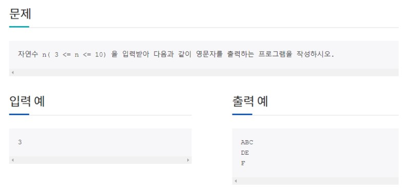
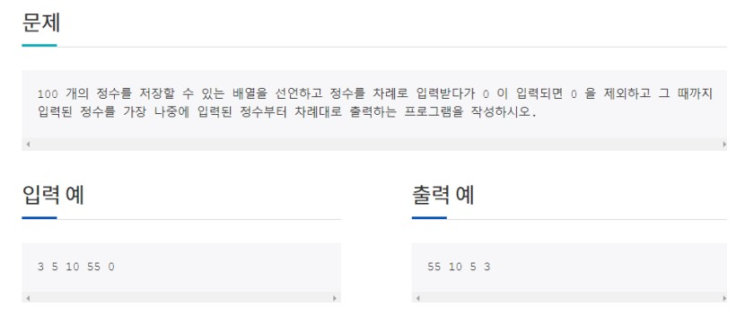
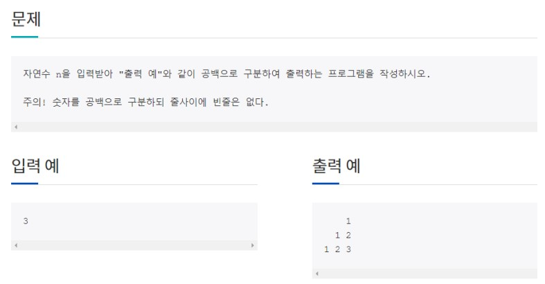
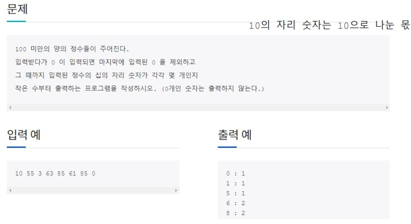
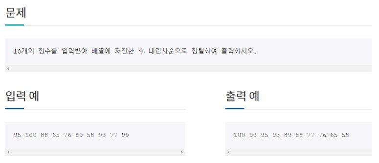

# 2021년 5월 20일 [과제]

## # 과제 1


```java
package com.java.homework;

import java.util.Iterator;
import java.util.Scanner;

public class Hw0521_1 {

	public static void main(String[] args) {
		Scanner sc = new Scanner(System.in);
		
		System.out.println("자연수 n을 입력하시오.");
		
		int a = sc.nextInt();
		char ch = 'A';
		int b = 1;
		
		for (int i = 0; i < a; i++) {
			for (int j = 0; j > i; j++) {
				System.out.print(" ");
			}
			for (int j = 0; j <= a-i-1; j++) {
				System.out.print(ch++);
			}
			System.out.println();
		}

	}

}
```

```cmd
자연수 n을 입력하시오.
3
ABC
DE
F
```

#


## # 과제 2


```java
package com.java.homework;

import java.util.Scanner;

public class Hw0521_2 {

	public static void main(String[] args) {
		
		Scanner in = new Scanner(System.in);	

		System.out.println("정수를 입력하시오.");
		
		int[] arr = new int[100];

		for(int i=0;i<arr.length;i++) {

			arr[i] = in.nextInt();

			if(arr[i] == 0)

				break;

		}

		System.out.println("'0' 을 입력하여 종료합니다.");

		for(int i=arr.length-1;i>=0;i--) {

			if(arr[i]!=0)
				

			System.out.print(arr[i]+" ");

		}
		
	}

}
```

```cmd
정수를 입력하시오.
3 5 10 55 0
'0' 을 입력하여 종료합니다.
55 10 5 3 
```


#

## # 과제 3  


```java
package com.java.homework;

import java.util.Scanner;

public class Hw0521_3 {

	public static void main(String[] args) {
		Scanner sc = new Scanner(System.in);
		
		System.out.println("자연수 n을 입력하시오.");
		
		int a = sc.nextInt();
		
		
		for (int i = 0; i < a; i++) {
			int b = 1;
			for (int j = 0; j < a-1-i; j++) {
				System.out.print("  ");
			}
			for (int j = 0; j < i+1; j++) {
				System.out.print(b++ + " ");
			}
			System.out.println();
		}

	}

}
```

```cmd
자연수 n을 입력하시오.
3
    1 
  1 2 
1 2 3 
```


#

## # 과제 4   

  

```java
package com.java.homework;

import java.util.Scanner;

public class Hw0521_4 {

	public static void main(String[] args) {
		
		Scanner in = new Scanner(System.in);
		
		System.out.println("100미만의 양의 정수를 입력하시오");
		
		int[] count = new int[10];

		String input = in.nextLine();

		String[] temp = input.split(" ");

		int[] arr = new int[temp.length];

		int quant;

		for (int i = 0; i < temp.length; i++) {

			arr[i] = Integer.parseInt(temp[i]);

		}

		for (int i = 0; i < temp.length; i++) {

			if (arr[i] != 0) {

				quant = arr[i] / 10;

				count[quant]++;

			}

		}

		for (int i = 0; i < count.length; i++) {

			if (count[i] != 0) {

				System.out.println(i + " : " + count[i]);

			}

		}

	}

}
```

```cmd
100미만의 양의 정수를 입력하시오
10 55 3 63 85 61 85 0
0 : 1
1 : 1
5 : 1
6 : 2
8 : 2
```


#


## # 과제 5  
  

```java
package com.java.homework;

import java.util.Scanner;

public class Hw0521_6 {

	public static void main(String[] args) {
		Scanner in = new Scanner(System.in);
		System.out.println("10개의 정수를 입력하시오.");
		int[] arr = new int[10];

		int temp;

		for (int i = 0; i < arr.length; i++) {
			
			arr[i] = in.nextInt();

		}

		for(int i=0;i<arr.length-1;i++) {

			for(int j=i+1;j<arr.length;j++) {

				if(arr[i] <arr[j]) {

					temp = arr[i];

					arr[i] = arr[j];

					arr[j] = temp;

				}

			}

		}
		
			System.out.println("<결과값>");
		
		for(int i=0;i<arr.length;i++) {
			
			System.out.print(arr[i]+" ");

		}

	}

}
```

```cmd
10개의 정수를 입력하시오.
95 100 88 65 76 89 58 93 77 99
<결과값>
100 99 95 93 89 88 77 76 65 58 
```


#
